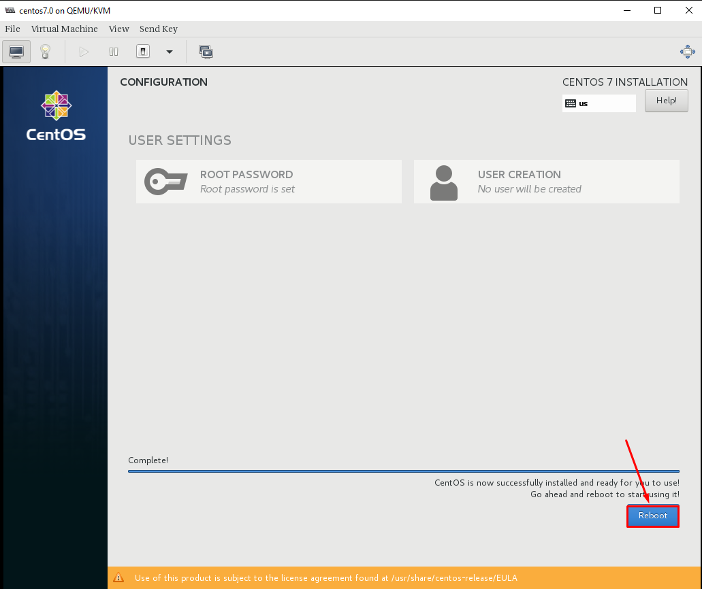
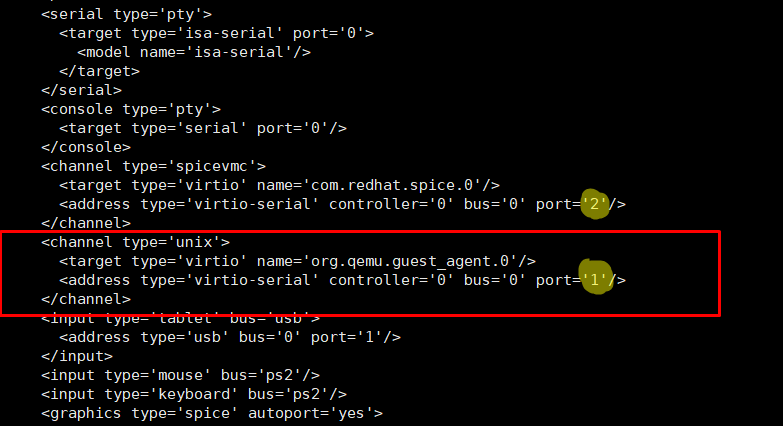

# Tài liệu đóng Image CentOS7 Blank
# Phần I. Khởi tạo Host
## Bước 1: Trên KVM host tạo máy ảo CentOS7

### 1. Khởi tạo ổ cứng sử dụng cho máy ảo:


### 2. thực hiện khởi tạo VM
-  `Instances` -> `+` sau đó thực hiện các bước khởi tạo sau: 


  - Lựa chọn `Custom` và điền các thông tin: Name, VCPU, RAM, HDD, Network rồi chọn `Create`:

- Mount ISO tiến hành cài đặt OS

- chỉnh lại thứ tự boot


### 3. Tạo `Snapshots` trước khi cài đặt OS


### 4. Bật máy ảo và Console vào để cài đặt OS


## Bước 2: Cài Đặt Centos 7

### 1. Cài đặt OS
- Chọn `Install CentOS7` để tiến hành cài đặt 


- Cấu hình ngôn ngữ chọn `English(English)`


- Cấu hình timezone về Ho_Chi_Minh


- Cấu hình disk để cài đặt 


- Chọn `Standard Partition` cho ổ disk 


- Cấu hình mount point `/` cho toàn bộ disk


- Định dạng lại `ext4` cho phân vùng


- Kết thúc quá trình cấu hình disk 


- Confirm quá trình chia lại partition cho disk 


- Cấu hình network 


- Turn on network cho interface và set hostname


- Kết thúc cấu hình, bắt đầu quá trình cài đặt OS


- Setup passwd cho root


- Reboot lại VM sau khi cài đặt hoàn tất



### 2. Chỉnh sửa file XML VM Lưu ý:

- Chỉnh sửa file .xml của máy ảo, bổ sung thêm channel trong (để máy host giao tiếp với máy ảo sử dụng qemu-guest-agent), sau đó save lại

Truy cập Settings > XML > EDIT SETTINGS


Nếu đã tồn tại channel đổi port channel này về port='2' và add channel bình thường



Định dạng
```shsh
<devices>
<channel type='unix'>
    <target type='virtio' name='org.qemu.guest_agent.0'/>
    <address type='virtio-serial' controller='0' bus='0' port='1'/>
</channel>
</devices>
```
# Phần II: Setup môi trường cơ bản CentOS7

## 1. Cấu hình và cài đặt các gói
Cài đặt `epel-release` và update
```sh
yum install epel-release -y
yum update -y
yum install -y wget
sudo yum  install zip unzip -y
```

## 2. Disable firewalld, SElinux
```sh
systemctl disable firewalld
systemctl stop firewalld

sed -i 's/SELINUX=enforcing/SELINUX=disabled/g' /etc/sysconfig/selinux
sed -i 's/SELINUX=permissive/SELINUX=disabled/g' /etc/sysconfig/selinux
sed -i 's/SELINUX=enforcing/SELINUX=disabled/g' /etc/selinux/config
sed -i 's/SELINUX=permissive/SELINUX=disabled/g' /etc/selinux/config
```

Reboot kiểm tra lại firewalld và SElinux

## 3. Cấu hình Network
Disable NetworkManager, sử dụng network service
```sh
systemctl disable NetworkManager
systemctl stop NetworkManager
systemctl enable network
systemctl start network
```

Disable IPv6:
```sh
echo "net.ipv6.conf.all.disable_ipv6 = 1" >> /etc/sysctl.conf
echo "net.ipv6.conf.default.disable_ipv6 = 1" >> /etc/sysctl.conf
sysctl -p
```

Kiểm tra
```sh
cat /proc/sys/net/ipv6/conf/all/disable_ipv6
```

Lưu ý: Kết quả ra `1` => Tắt thành công, `0` tức IPv6 vẫn bật

## 4. Cấu hình SSH
```sh
sed -i 's/#ListenAddress 0.0.0.0/ListenAddress 0.0.0.0/g' /etc/ssh/sshd_config 
sed -i 's/#PermitRootLogin yes/PermitRootLogin yes/g' /etc/ssh/sshd_config 
systemctl restart sshd
```

## 5. Điều chỉnh timezone
Đổi timezone về `Asia/Ho_Chi_Minh`
```sh
timedatectl set-timezone Asia/Ho_Chi_Minh
```
## 6. Cài đặt chronyd
```sh
yum install chrony -y
sed -i 's|server 1.vn.pool.ntp.org iburst|server 162.159.200.123 iburst|g' /etc/chrony.conf
systemctl enable --now chronyd 
hwclock --systohc
```

## 7. Cấu hình console và network

Để sử dụng nova console-log, bạn cần thay đổi option cho `GRUB_CMDLINE_LINUX` và lưu lại 

```sh sh
sed -i 's/GRUB_CMDLINE_LINUX="crashkernel=auto rhgb quiet"/GRUB_CMDLINE_LINUX="crashkernel=auto console=tty0 console=ttyS0,115200n8"/g' /etc/default/grub
grub2-mkconfig -o /boot/grub2/grub.cfg
```


- Disable Default routing

```sh sh
echo "NOZEROCONF=yes" >> /etc/sysconfig/network
```

- Xóa thông tin card mạng
```sh sh
rm -f /etc/sysconfig/network-scripts/ifcfg-eth0
```

- Để sau khi boot máy ảo, có thể nhận đủ các NIC gắn vào:

```shsh 
cat << EOF >> /etc/rc.local
for iface in \$(ip -o link | cut -d: -f2 | tr -d ' ' | grep ^eth)
do
   test -f /etc/sysconfig/network-scripts/ifcfg-\$iface
   if [ \$? -ne 0 ]
   then
       touch /etc/sysconfig/network-scripts/ifcfg-\$iface
       echo -e "DEVICE=\$iface\nBOOTPROTO=dhcp\nONBOOT=yes" > /etc/sysconfig/network-scripts/ifcfg-\$iface
       ifup \$iface
   fi
done
EOF
```

- Thêm quyền thực thi cho file `/etc/rc.local`
```sh
chmod +x /etc/rc.local 
```

- Xóa file hostname

```sh sh
rm -f /etc/hostname
```

### 8. Tạo Snapshot Begin

# Phần III. Phần Cài đặt một số dịch vụ cần thiết cho Template
- Cài đặt acpid nhằm cho phép hypervisor có thể reboot hoặc shutdown instance.
    ```
    yum install acpid -y
    systemctl enable acpid
    ```

- Cài đặt qemu guest agent, kích hoạt và khởi động qemu-guest-agent service
    ```
    yum install -y qemu-guest-agent
    systemctl enable qemu-guest-agent.service
    systemctl start qemu-guest-agent.service
    ```

**Lưu ý:**

- Để sử sụng qemu-agent, phiên bản selinux phải > 3.12
    ```
    rpm -qa | grep -i selinux-policy
    ```
- Để có thể thay đổi password máy ảo thì phiên bản qemu-guest-agent phải >= 2.5.0
    ```
    qemu-ga --version
    ```
- Cài đặt CMDlog và  welcome Display
```
curl -Lso- https://raw.githubusercontent.com/nhanhoadocs/ghichep-cmdlog/master/cmdlog.sh | bash
wget https://raw.githubusercontent.com/danghai1996/create-images-openstack/master/scripts_all/linux-login.sh -O /etc/profile.d/linux-login.sh && chmod +x /etc/profile.d/linux-login.sh

```
Log out rồi login lại kiểm tra:
  - Log cmd: /var/log/cmdlog.log
  - Giao diện sau khi login:
      ```
    Welcome to Cloud365 | nhanhoa.com

    Tue 23 Mar 2021 03:04:17 PM +07

    ______ __                   __ _____  _____  ______
    / ____// /____   __  __ ____/ /|__  / / ___/ / ____/
    / /    / // __ \ / / / // __  /  /_ < / __ \ /___ \
    / /___ / // /_/ // /_/ // /_/ / ___/ // /_/ /____/ /
    \____//_/ \____/ \__,_/ \__,_/ /____/ \____//_____/

    * Trang chu NhanHoa : https://nhanhoa.com/
    * Cloud365          : https://cloud365.vn/
    * Portal            : https://portal.cloud365.vn/
    * Huong dan su dung : https://support.cloud365.vn/
    * Email ho tro      : support@nhanhoa.com

    *----------------------------------------------------*

    root@cloud:~# 
    ```
Kiểm tra lỗ hổng CVE-2021 và dọn dẹp
```
sudoedit -s /
```
- Kết quả trả ra như sau:
```
TH1: "sudoedit: /: not a regular file" -> sudo có lỗ hổng
TH2:  "usage: sudoedit [-AknS] [-r role] [-t type] [-C num] [-g group] [-h host] [-p prompt] [-T timeout] [-u user] file" -> sudo đã được vá.
```

- Cài đặt cloud-init và cloud-utils:
    ```
    yum install -y cloud-init cloud-utils
    ```
    Để máy ảo trên OpenStack có thể nhận được Cloud-init cần thay đổi cấu hình mặc định bằng cách sửa đổi file `/etc/cloud/cloud.cfg`.
    ```
    sed -i 's/disable_root: 1/disable_root: 0/g' /etc/cloud/cloud.cfg
    sed -i 's/ssh_pwauth:   0/ssh_pwauth:   1/g' /etc/cloud/cloud.cfg
    sed -i 's/name: centos/name: root/g' /etc/cloud/cloud.cfg
    ```
- Clean all
```
    yum clean all

    rm -f /var/log/wtmp /var/log/btmp

    rm -f /root/.bash_history

    > /var/log/cmdlog.log

    history -c
```
# Phần III. Tổi ưu và dẩy images

### Bước 1: Sử dụng lệnh virt-sysprep để xóa toàn bộ các thông tin máy ảo

```
virt-sysprep -d OPS_Template_CentOS7
```

### Bước 2: Tối ưu kích thước image:
```
virt-sparsify --compress --convert qcow2 /var/lib/libvirt/images/OPS_Template_CentOS7.qcow2 OPS_Template_CentOS7
```

### Bước 3: Upload image lên glance và sử dụng
- trước tiên cần Coppy file images sang note Controller
- Convert images về định dạng raw
```
qemu-img convert -O raw OPS_Template_CentOS7 OPS_Template_CentOS7.raw
```
- Đẩy image lên hệ thống và sử dụng
```
glance image-create --name OPS_Template_CentOS7 \
--file /root/image-create-ops-test/OPS_Template_CentOS7.raw \
--disk-format raw \
--container-format bare \
--visibility=public \
--property hw_qemu_guest_agent=yes \
--min-disk 10 --min-ram 1024 --progress
```


### Bước 4: Nội dung cloud-init
```
#cloud-config
password: '{vps_password}'
chpasswd: { expire: False }
ssh_pwauth: True
```