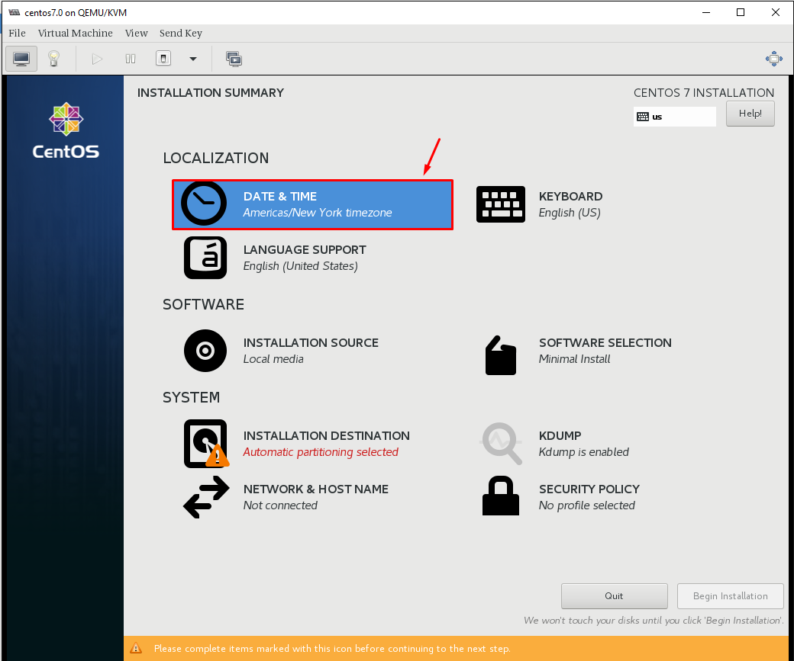
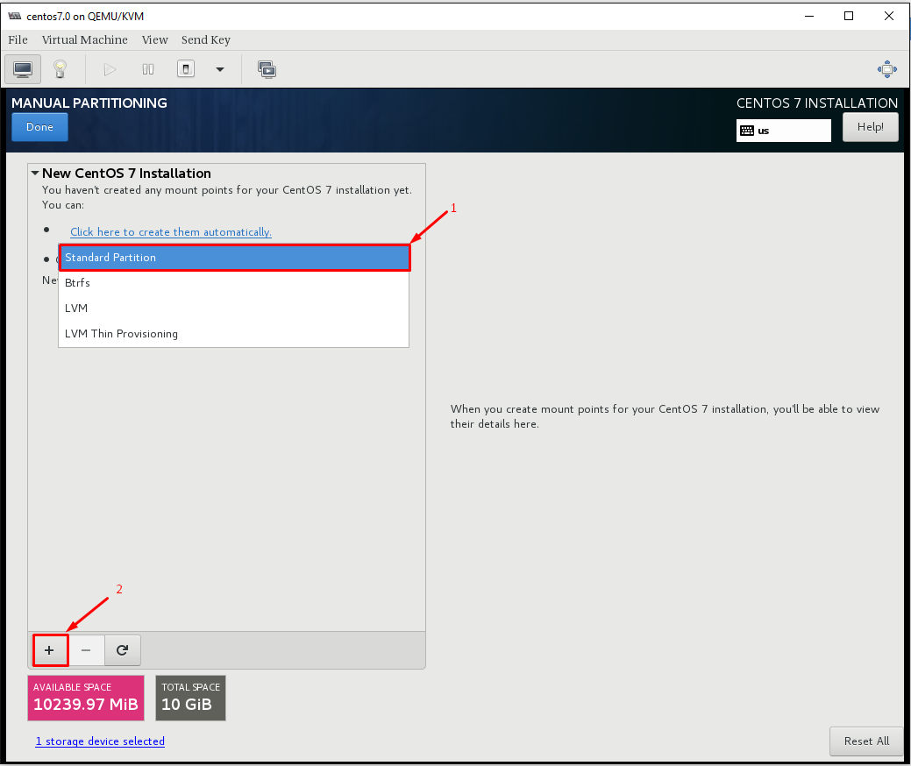
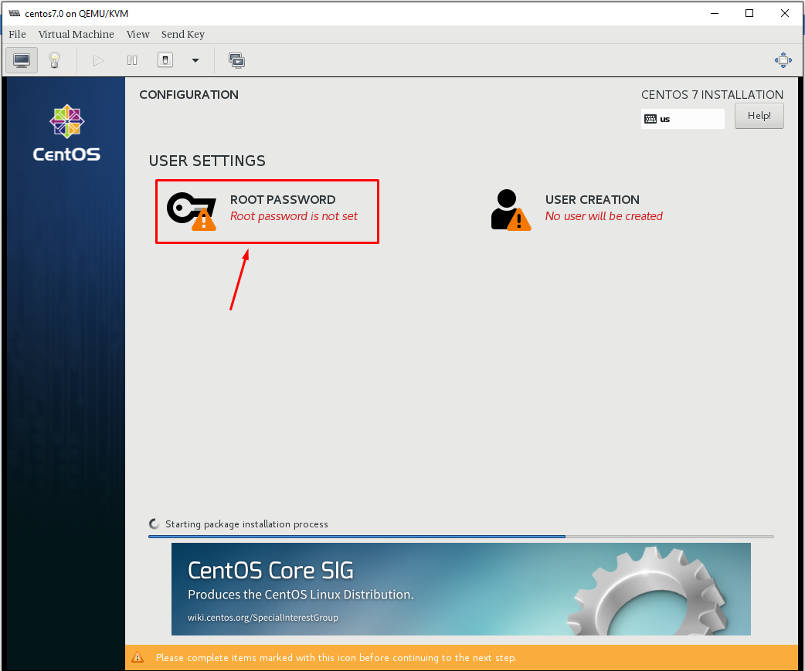

# Tài liệu đóng Image CentOS7 + Directadmin + Openlitespeed
# Phần I. Khởi tạo Host
## Bước 1: Trên KVM host tạo máy ảo CentOS7

### 1. Khởi tạo ổ cứng sử dụng cho máy ảo:


### 2. thực hiện khởi tạo VM
-  `Instances` -> `+` sau đó thực hiện các bước khởi tạo sau: 


  - Lựa chọn `Custom` và điền các thông tin: Name, VCPU, RAM, HDD, Network rồi chọn `Create`:

- Mount ISO tiến hành cài đặt OS

- chỉnh lại thứ tự boot


### 3. Tạo `Snapshots` trước khi cài đặt OS


### 4. Bật máy ảo và Console vào để cài đặt OS


## Bước 2: Cài Đặt Centos 7

### 1. Cài đặt OS
- Chọn `Install CentOS7` để tiến hành cài đặt 


- Cấu hình ngôn ngữ chọn `English(English)`


- Cấu hình timezone về Ho_Chi_Minh




- Cấu hình disk để cài đặt 


- Chọn `Standard Partition` cho ổ disk 



- Cấu hình mount point `/` cho toàn bộ disk


- Định dạng lại `ext4` cho phân vùng


- Kết thúc quá trình cấu hình disk 


- Confirm quá trình chia lại partition cho disk 


- Cấu hình network 


- Turn on network cho interface và set hostname


- Kết thúc cấu hình, bắt đầu quá trình cài đặt OS


- Setup passwd cho root




- Reboot lại VM sau khi cài đặt hoàn tất


### 2. Chỉnh sửa file XML VM Lưu ý:

- Chỉnh sửa file .xml của máy ảo, bổ sung thêm channel trong (để máy host giao tiếp với máy ảo sử dụng qemu-guest-agent), sau đó save lại

Truy cập Settings > XML > EDIT SETTINGS


Nếu đã tồn tại channel đổi port channel này về port='2' và add channel bình thường


Định dạng
```shsh
<devices>
<channel type='unix'>
    <target type='virtio' name='org.qemu.guest_agent.0'/>
    <address type='virtio-serial' controller='0' bus='0' port='1'/>
</channel>
</devices>
```
# Phần II: Setup môi trường cơ bản CentOS7

## 1. Cấu hình và cài đặt các gói
Cài đặt `epel-release` và update
```sh
yum install epel-release -y
yum update -y
yum install -y wget
sudo yum  install zip unzip -y
```

## 2. Disable firewalld, SElinux
```sh
systemctl disable firewalld
systemctl stop firewalld

sed -i 's/SELINUX=enforcing/SELINUX=disabled/g' /etc/sysconfig/selinux
sed -i 's/SELINUX=permissive/SELINUX=disabled/g' /etc/sysconfig/selinux
sed -i 's/SELINUX=enforcing/SELINUX=disabled/g' /etc/selinux/config
sed -i 's/SELINUX=permissive/SELINUX=disabled/g' /etc/selinux/config
```

Reboot kiểm tra lại firewalld và SElinux

## 3. Cấu hình Network
Disable NetworkManager, sử dụng network service
```sh
systemctl disable NetworkManager
systemctl stop NetworkManager
systemctl enable network
systemctl start network
```

Disable IPv6:
```sh
echo "net.ipv6.conf.all.disable_ipv6 = 1" >> /etc/sysctl.conf
echo "net.ipv6.conf.default.disable_ipv6 = 1" >> /etc/sysctl.conf
sysctl -p
```

Kiểm tra
```sh
cat /proc/sys/net/ipv6/conf/all/disable_ipv6
```

Lưu ý: Kết quả ra `1` => Tắt thành công, `0` tức IPv6 vẫn bật

## 4. Cấu hình SSH
```sh
sed -i 's/#ListenAddress 0.0.0.0/ListenAddress 0.0.0.0/g' /etc/ssh/sshd_config 
sed -i 's/#PermitRootLogin yes/PermitRootLogin yes/g' /etc/ssh/sshd_config 
systemctl restart sshd
```

## 5. Điều chỉnh timezone
Đổi timezone về `Asia/Ho_Chi_Minh`
```sh
timedatectl set-timezone Asia/Ho_Chi_Minh
```
## 6. Cài đặt chronyd
```sh
yum install chrony -y
sed -i 's|server 1.vn.pool.ntp.org iburst|server 162.159.200.123 iburst|g' /etc/chrony.conf
systemctl enable --now chronyd 
hwclock --systohc
```

## 7. Cấu hình console và network

Để sử dụng nova console-log, bạn cần thay đổi option cho `GRUB_CMDLINE_LINUX` và lưu lại 

```sh sh
sed -i 's/GRUB_CMDLINE_LINUX="crashkernel=auto rhgb quiet"/GRUB_CMDLINE_LINUX="crashkernel=auto console=tty0 console=ttyS0,115200n8"/g' /etc/default/grub
grub2-mkconfig -o /boot/grub2/grub.cfg
```


- Disable Default routing

```sh sh
echo "NOZEROCONF=yes" >> /etc/sysconfig/network
```

- Xóa thông tin card mạng
```sh sh
rm -f /etc/sysconfig/network-scripts/ifcfg-eth0
```

- Để sau khi boot máy ảo, có thể nhận đủ các NIC gắn vào:

```shsh 
cat << EOF >> /etc/rc.local
for iface in \$(ip -o link | cut -d: -f2 | tr -d ' ' | grep ^eth)
do
   test -f /etc/sysconfig/network-scripts/ifcfg-\$iface
   if [ \$? -ne 0 ]
   then
       touch /etc/sysconfig/network-scripts/ifcfg-\$iface
       echo -e "DEVICE=\$iface\nBOOTPROTO=dhcp\nONBOOT=yes" > /etc/sysconfig/network-scripts/ifcfg-\$iface
       ifup \$iface
   fi
done
EOF
```

- Thêm quyền thực thi cho file `/etc/rc.local`
```sh
chmod +x /etc/rc.local 
```

- Xóa file hostname

```sh sh
rm -f /etc/hostname
```

###8. Tạo Snapshot Begin
## Phần III. Cài đặt DirectAdmin

Sau đó cài đặt DA theo hướng dẫn sau:
```
wget --user=nhanhoa --password=15935700 103.57.210.13/latest
chmod +x latest
./latest
```

Chờ script chạy xong. Khoảng 20-30 phút

### Build let’s encrypt trong directadmin 

Lưu ý: Let’s Encrypt chỉ hỗ trợ với version directadmin từ 1.5 trở lên

Bật tính năng Let’s Encrypt trong directadmin 

    echo "letsencrypt=1" >> /usr/local/directadmin/conf/directadmin.conf

Bật SNI trên DirectAdmin

    echo "enable_ssl_sni=1" >> /usr/local/directadmin/conf/directadmin.conf

Khời động lại dịch vụ DirectAdmin

    systemctl restart directadmin

Update license Let's Encrypt

    wget -O /usr/local/directadmin/scripts/letsencrypt.sh http://files.directadmin.com/services/all/letsencrypt.sh

Update web-server configs trên DirectAdmin

    cd /usr/local/directadmin/custombuild
    ./build letsencrypt
    ./build rewrite_confs

Cài đặt đa phiên bản php trong Directadmin

Trong hướng dẫn này sẽ build version php 5.6 và 7.4

    cd /usr/local/directadmin/custombuild

    ./build set php1_mode suphp
    ./build set php2_mode suphp
    ./build set php1_release 7.4
    ./build set php2_release 5.6

Sửa file `/usr/local/directadmin/custombuild/options.conf`

    vi /usr/local/directadmin/custombuild/options.conf 

Sửa 2 dòng:

    secure_php=yes


và

    downloadserver=files25.directadmin.com


Sau đó build PHP

    ./build php n
    ./build rewrite_confs

### Cài CSF

    wget http://files.directadmin.com/services/all/csf/csf_install.sh

    /bin/sh ./csf_install.sh

Update và kiểm tra lại phiên bản

    csf -u
    csf -v

Allow thêm port 465 outgoing
```
vi /etc/csf/csf.conf

```
Thêm 465 vào dòng:

    # Allow outgoing TCP ports
    TCP_OUT = "20,21,22,25,53,80,110,113,443,587,993,995,2222,465"


Sửa file `/etc/csf/csf.allow`
```
vi /etc/csf/csf.allow

```

Xóa IP mặc định được allow đi. Thêm vào IP Nhân Hòa và google 
```
Include /etc/csf/google.allow
117.4.255.125
```
- nội dung file /etc/csf/google.allow

```

64.18.0.0/20
64.233.160.0/19
66.102.0.0/20
66.249.80.0/20
72.14.192.0/18
74.125.0.0/16
108.177.0.0/17
172.217.0.0/19
173.194.0.0/16
207.126.144.0/20
209.85.128.0/17
216.58.192.0/19
216.239.32.0/19
2001:4860:4000::/36
2404:6800:4000::/36
2607:f8b0:4000::/36
2800:3f0:4000::/36
2a00:1450:4000::/36
2c0f:fb50:4000::/36
```


### Build Roundcube 

    cd /usr/local/directadmin/custombuild
    ./build roundcube

### Cài imunifyAV

    wget https://repo.imunify360.cloudlinux.com/defence360/imav-deploy.sh
    bash imav-deploy.sh
    yum update imunify-antivirus -y

### Check version Apache

    httpd -v

Phiên bản stable mới nhất hiện tại là 2.4.46

### Secure thư mục `/tmp`

    mount -t tmpfs -o defaults,nodev,nosuid,noexec tmpfs /tmp/
    mount -t tmpfs -o defaults,nodev,nosuid,noexec tmpfs /var/tmp/
    mount -t tmpfs -o defaults,nodev,nosuid,noexec tmpfs /dev/shm

    echo "tmpfs                   /tmp                    tmpfs   defaults,nodev,nosuid,noexec        0 0" >> /etc/fstab
    echo "tmpfs                   /var/tmp                tmpfs   defaults,nodev,nosuid,noexec        0 0" >> /etc/fstab
    echo "tmpfs                   /dev/shm                tmpfs   defaults,nodev,nosuid,noexec        0 0" >> /etc/fstab

### Nâng cấp phiên bản custombuild từ 1.x lên 2.0
```
cd /usr/local/directadmin
mv custombuild custombuild_1.x
wget -O custombuild.tar.gz http://files.directadmin.com/services/custombuild/2.0/custombuild.tar.gz
tar xvzf custombuild.tar.gz
cd custombuild
./build
```

### Build MariaDB 10.5
1. Cài đặt MariaDB 10.5
```
cd /usr/local/directadmin/custombuild
./build update
./build set mariadb 10.5
./build set mysql_inst mariadb
./build set mysql_backup yes
./build mariadb
```
2. Build phpmyadmin
```
cd /usr/local/directadmin/custombuild
./build update
./build phpmyadmin
```
3. Allow login Root cho Phpmyadmin
```
vi /var/www/html/phpMyAdmin-5.1.1-all-languages/config.inc.php

thay thế: $cfg['Servers'][$i]['AllowRoot'] = false;
bằng : $cfg['Servers'][$i]['AllowRoot'] = true;
```
### Chỉnh sửa các thông số
1. Mysql
```
mysql -u root -p
SET global max_connections = 500;
SET global connect_timeout = 100;
```
- Kiểm tra 
```
show variables like 'max_connections';
show variables like 'connect_timeout';
```


2. Tắt sql_mode
```
SET GLOBAL sql_mode='NO_ZERO_IN_DATE,NO_ZERO_DATE,ERROR_FOR_DIVISION_BY_ZERO,NO_AUTO_CREATE_USER,NO_ENGINE_SUBSTITUTION';

```


3. Cấu hình pure-ftpd

- Cấu hình passive port từ 35000:35100 bên trong file cấu hình: `vi /etc/pure-ftpd.conf`


- Cấu hình mở IN passive port cho FTP trong CSF: `vi /etc/csf/csf.conf`


4. Chỉnh sửa php.ini
```
- max_execution_time lên 300
- max_input_vars lên 5000
- memory_limit lên 256
```


## Phần IV. Cài đặt Openlitespeed

1. Cài đặt
```
cd /usr/local/directadmin/custombuild
./build update
./build set webserver openlitespeed
./build set mod_ruid2 no
./build set php1_mode lsphp
./build set php2_mode lsphp
./build set php3_mode lsphp
./build set php4_mode lsphp
./build openlitespeed
./build php n
./build rewrite_confs
```
- Allow Port `7080`  outgoing  avf ingoing bên trong file: /etc/csf/csf.conf


2. cài đặt Memcached PHP
-  installed memcached
```
yum install memcached memcached-devel libmemcached-devel libmemcached -y
cd /usr/local/directadmin/scripts/custom
wget https://raw.githubusercontent.com/poralix/directadmin-utils/master/php/php-extension.sh -O php-extension.sh
chmod 750 php-extension.sh
./php-extension.sh install memcached
```
Sau khi cài đặt xong bạn sẽ thấy thông báo có đính kèm liên kết đến thư mục chưa file của memcached module dạng như sau:
```
nstalling shared extensions:     /usr/local/php80/lib/php/extensions/no-debug-non-zts-20200930/
[OK] Installation of memcached for php80 completed!
[OK] Found memcached.so. Enabling the extension in /usr/local/php80/lib/php.conf.d/90-custom.ini
memcached
memcached support => enabled
memcached.compression_factor => 1.3 => 1.3
```
- Config memcached
  - Sử dụng lệnh sau để tìm file php.ini
```
php -i | grep "php.ini"
```
  - Tiếp đến mở file php.ini ra và thêm vào cuối file đoạn chỉ thị sau:
```
extension = "/usr/local/php74/lib/php/extensions/no-debug-non-zts-20190902/memcached.so"
extension = "/usr/local/php80/lib/php/extensions/no-debug-non-zts-20200930/memcached.so"
extension = "/usr/local/php70/lib/php/extensions/no-debug-non-zts-20151012/memcached.so"

```
- Khởi động memcached cùng hệ thống
```
systemctl start memcached
systemctl enable memcached
systemctl status memcached
```
- kiểm tra 
```
cd /usr/local/directadmin/scripts/custom
./php-extension.sh status memcached
```

3. 2. cài đặt Redis PHP

```
cd /usr/local/directadmin/scripts/custom
wget https://raw.githubusercontent.com/poralix/directadmin-utils/master/php/php-extension.sh -O php-extension.sh
chmod 750 php-extension.sh
./php-extension.sh install redis
./php-extension.sh status redis
```

# Phần III. Phần Cài đặt một số dịch vụ cần thiết cho Template
- Cài đặt acpid nhằm cho phép hypervisor có thể reboot hoặc shutdown instance.
    ```
    yum install acpid -y
    systemctl enable acpid
    ```

- Cài đặt qemu guest agent, kích hoạt và khởi động qemu-guest-agent service
    ```
    yum install -y qemu-guest-agent
    systemctl enable qemu-guest-agent.service
    systemctl start qemu-guest-agent.service
    ```

**Lưu ý:**

- Để sử sụng qemu-agent, phiên bản selinux phải > 3.12
    ```
    rpm -qa | grep -i selinux-policy
    ```
- Để có thể thay đổi password máy ảo thì phiên bản qemu-guest-agent phải >= 2.5.0
    ```
    qemu-ga --version
    ```
- Cài đặt CMDlog và  welcome Display
```
curl -Lso- https://raw.githubusercontent.com/nhanhoadocs/ghichep-cmdlog/master/cmdlog.sh | bash
wget https://raw.githubusercontent.com/danghai1996/create-images-openstack/master/scripts_all/linux-login.sh -O /etc/profile.d/linux-login.sh && chmod +x /etc/profile.d/linux-login.sh

```
Log out rồi login lại kiểm tra:
  - Log cmd: /var/log/cmdlog.log
  - Giao diện sau khi login:
      ```
    Welcome to Cloud365 | nhanhoa.com

    Tue 23 Mar 2021 03:04:17 PM +07

    ______ __                   __ _____  _____  ______
    / ____// /____   __  __ ____/ /|__  / / ___/ / ____/
    / /    / // __ \ / / / // __  /  /_ < / __ \ /___ \
    / /___ / // /_/ // /_/ // /_/ / ___/ // /_/ /____/ /
    \____//_/ \____/ \__,_/ \__,_/ /____/ \____//_____/

    * Trang chu NhanHoa : https://nhanhoa.com/
    * Cloud365          : https://cloud365.vn/
    * Portal            : https://portal.cloud365.vn/
    * Huong dan su dung : https://support.cloud365.vn/
    * Email ho tro      : support@nhanhoa.com

    *----------------------------------------------------*

    root@cloud:~# 
    ```
Kiểm tra lỗ hổng CVE-2021 và dọn dẹp
```
sudoedit -s /
```
- Kết quả trả ra như sau:
```
TH1: "sudoedit: /: not a regular file" -> sudo có lỗ hổng
TH2:  "usage: sudoedit [-AknS] [-r role] [-t type] [-C num] [-g group] [-h host] [-p prompt] [-T timeout] [-u user] file" -> sudo đã được vá.
```

- Cài đặt cloud-init và cloud-utils:
    ```
    yum install -y cloud-init cloud-utils
    ```
    Để máy ảo trên OpenStack có thể nhận được Cloud-init cần thay đổi cấu hình mặc định bằng cách sửa đổi file `/etc/cloud/cloud.cfg`.
    ```
    sed -i 's/disable_root: 1/disable_root: 0/g' /etc/cloud/cloud.cfg
    sed -i 's/ssh_pwauth:   0/ssh_pwauth:   1/g' /etc/cloud/cloud.cfg
    sed -i 's/name: centos/name: root/g' /etc/cloud/cloud.cfg
    ```
- Clean all
```
    yum clean all

    rm -f /var/log/wtmp /var/log/btmp

    rm -f /root/.bash_history

    > /var/log/cmdlog.log

    history -c
```
# Phần IV. Tổi ưu và dẩy images

### Bước 1: Sử dụng lệnh virt-sysprep để xóa toàn bộ các thông tin máy ảo

```
virt-sysprep -d OPS_Template_DA_OLS
```

### Bước 2: Tối ưu kích thước image:
```
virt-sparsify --compress --convert qcow2 /var/lib/libvirt/images/OPS_Template_DA_OLS.qcow2 OPS_Template_DA_OLS
```

### Bước 3: Upload image lên glance và sử dụng
- trước tiên cần Coppy file images sang note Controller
- Convert images về định dạng raw
```
qemu-img convert -O raw OPS_Template_DA_OLS OPS_Template_DA_OLS.raw
```
- Đẩy image lên hệ thống và sử dụng
```
glance image-create --container-format bare --visibility=public \
--name OPS_Template_DA_OLS --disk-format raw \
--file /root/image-create-ops-test/OPS_Template_DA_OLS.raw --visibility=public \
--property os_type=linux \
--property hw_qemu_guest_agent=yes \
--property vps_image_user=root \
--property vps_image_type=CentOS \
--property vps_image_app=true \
--min-disk 10 --min-ram 1024 --progress
```


### Bước 4: Nội dung cloud-init

```
#cloud-config
password: '{vps_password}'
chpasswd: { expire: False }
ssh_pwauth: True
write_files:
- encoding: gzip
  content: !!binary |
    H4sIAE38QmEAA81Wa2/iRhT97l9xS1gZumuMDSGRqFXl4WSRWEh5rNQ2rTXYA4zWr/WMQ6Kw/e29Y2MwIdluVq1UlMDMnTtn7vPMHP2gz1iozwhfKkcwopwKuCGcr6LEgwkNYp8IiiuTJQkXg48wwN/3EYELP0qlAgkUXL3GXSycRxA88M++k0SRcGKJ4gEJPfCIQ7yAhbV8ORtv1usQb05TIt/bCB3DqtZcIkBPeaL7kUt83WMJdUW2VeduwmLBdTQ2jRviXsAaFgmN8+MtnLmpAM0D1VJBm5tavQxufid4tiwxXjyAxd8JjRufwwzpKsdkMWhtNMBLgC+jFVCxbBZ7tegG1NrPP1kspOKW12+9t7XbBn7XH1tfVNRaUuKBFoJRl6nqhTEeM0+iAFyZQ42FTGQn7WJvlOcYLrM8b1nV1hOgBJMcBSjbh6l5WDvw9g1HI/iSmMcdngY4xmKjnfbWMheMDnSBusuovo9hvgajucVAkAtZrnRXW3IBNAqVahn+NtybVhCuqFqZLwk09inGeB4lkFAuSCLgw8P4lz5c0FAMx513MJ2loUiN9nZ0qrA5ZEVAhav/mFCfoq1FtvJ9XRBLGiqAH1T+Haq1JA5A0+gd8UF98+iiVsSdO5p8UetgWaB2VPgDStvkh9Pkjrk0r3qvMHC3nJluNHkmmTOF+l+z7M/B2Qe7mOS+HJrp85lT7MOgF05FHg1JIKHI6hOoj3HCQgFVs7BeJCkXD5kLex5khsgCbHj6/9+LGYtC5h56wR+4oIEr/G2N5L687AP+KUqmlBUaZj7FZFqSN3FcVK1VLVPitpihXLSGcnSIU/DtS1jm81jmrk2y7fvt0Xoyld1S4jmfr7ie01zAuCuHUrOB94psI3JHsxtCOeIU+5VBha9ztt5zspCVPVwvKt9MqMoOfUfXe66X5WXfX3VKyYl8/5MzCuE3HuBG4Tyv/4YcHsAf5K8kft0RDRfhd/zYu5HjjJJO4Sad+czFLCGxoLoHPt4o/wmZnT5DZv/OXZcFLgQzrm+B2dyLVmEGU5Kl8U6yaUj5BvqnEmAxX5EYixqq+YWfNxCLlez1hGOMGjrM6TfBLajo5+qyTzZZV/naaLZPj086TRyctE7axqnZXi/Ur+a2JMiLqLgdSgtbflqvnyGtkmJWIgjCFjmV5VwFWgo5RcV7DZoxxtiewHV/eH7Wh4DcO2hCiGjImBwsOG42u0pJY7PqCBbQCF8RFpLjvoZ8JwZIyJY6GDq/2aOh0xs4l2cT+10xzyb2aDQcOVf4f9n72Bv3hgPn/NdsXeqdTSdD52Jko6YzHdsjKbMH172B7Yyn5+NJbzKd4Ba1q3hJFOMzVRD5rpCxeSqKaYKPgICELnW4u6QB6SpX/en4PdyM8OS+fW2Pu5WcQCuXw4FdUZTDEGPVYtd+wuhKFfy5YvdYMJwiLFyW4u968JeywvIAbYCxaTWOTxqm0WwYLX3O7rNiWUJjO96k2k1k2xY3aNmWvwFYTcIL5wsAAA==
  path: /opt/DA-OLS-Pass.sh
  permissions: '0755'
runcmd:
  - bash /opt/DA-OLS-Pass.sh {vps_mysql_password} {vps_da_password} {vps_ols_password}
  - rm -rf /opt/DA-OLS-Pass.sh
  - cd /usr/local/directadmin/custombuild && ./build openlitespeed && ./build rewrite_confs
  - sed -i 's|10485760|1073741824|g' /usr/local/directadmin/conf/directadmin.conf && service directadmin restart
```