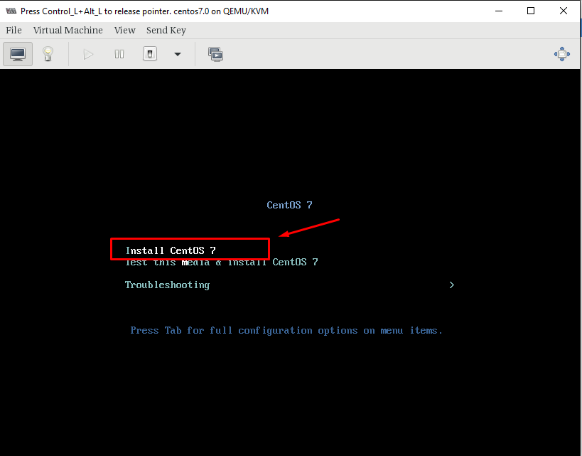
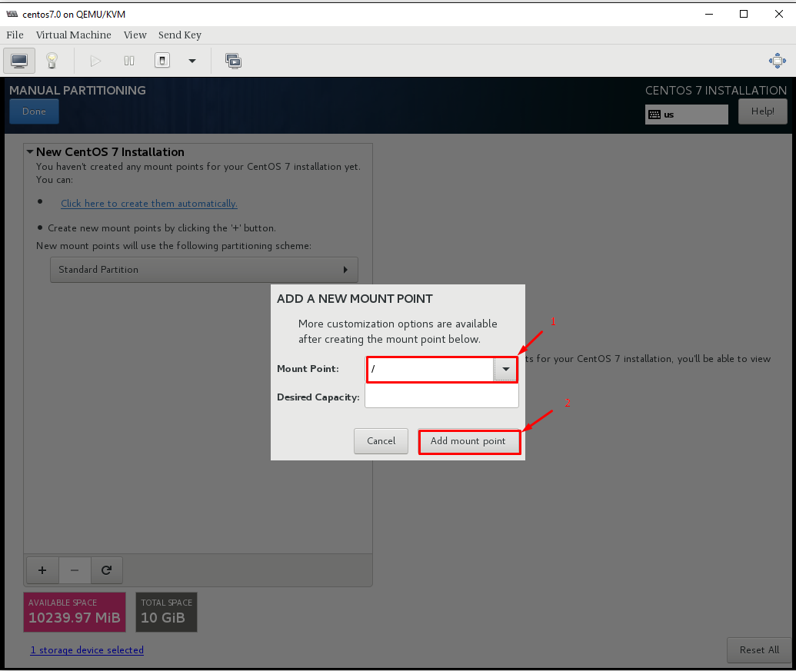
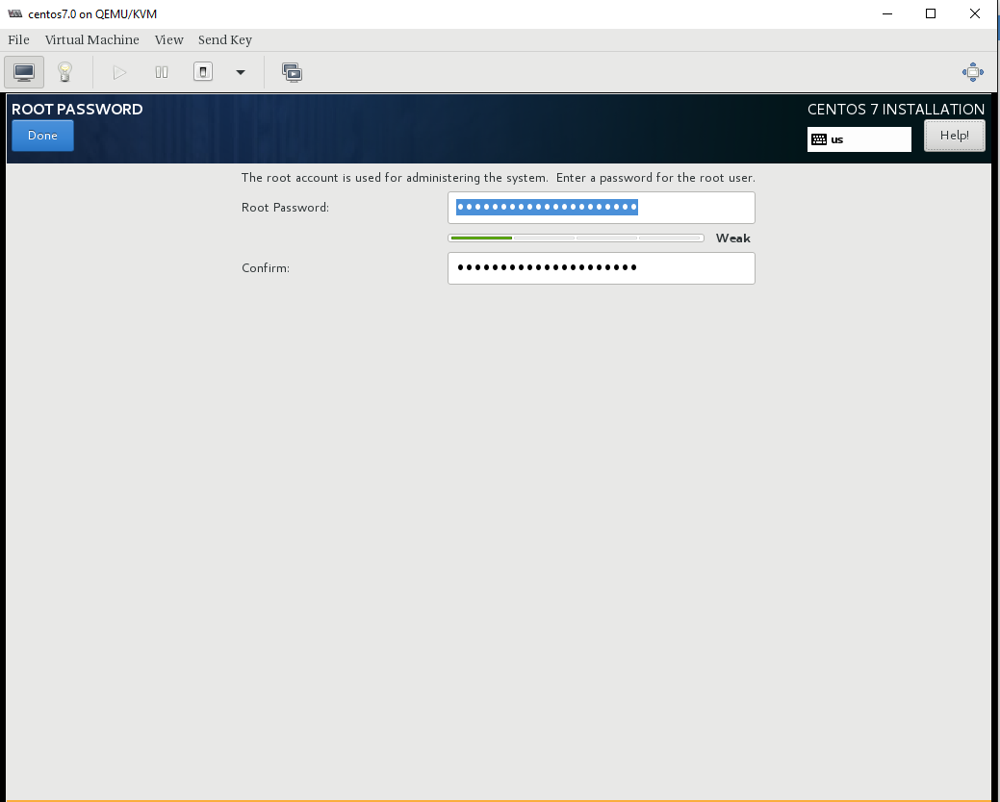

# Tài liệu đóng Image CentOS7 + Directadmin + Openlitespeed

## Bước 1: Trên KVM host tạo máy ảo CentOS7

### 1. Khởi tạo ổ cứng sử dụng cho máy ảo:


### 2. thực hiện khởi tạo VM
-  `Instances` -> `+` sau đó thực hiện các bước khởi tạo sau: 


  - Lựa chọn `Custom` và điền các thông tin: Name, VCPU, RAM, HDD, Network rồi chọn `Create`:

- Mount ISO tiến hành cài đặt OS

- chỉnh lại thứ tự boot


### 3. Tạo `Snapshots` trước khi cài đặt OS


### 4. Bật máy ảo và Console vào để cài đặt OS


## Bước 2: Cài Đặt Centos 7

### 1. Cài đặt OS
- Chọn `Install CentOS7` để tiến hành cài đặt 




- Cấu hình ngôn ngữ chọn `English(English)`


- Cấu hình timezone về Ho_Chi_Minh


- Cấu hình disk để cài đặt 


- Chọn `Standard Partition` cho ổ disk 


- Cấu hình mount point `/` cho toàn bộ disk



- Định dạng lại `ext4` cho phân vùng


- Kết thúc quá trình cấu hình disk 


- Confirm quá trình chia lại partition cho disk 


- Cấu hình network 


- Turn on network cho interface và set hostname


- Kết thúc cấu hình, bắt đầu quá trình cài đặt OS


- Setup passwd cho root





- Reboot lại VM sau khi cài đặt hoàn tất


### 2. Chỉnh sửa file XML VM Lưu ý:

- Chỉnh sửa file .xml của máy ảo, bổ sung thêm channel trong (để máy host giao tiếp với máy ảo sử dụng qemu-guest-agent), sau đó save lại

Truy cập Settings > XML > EDIT SETTINGS


Nếu đã tồn tại channel đổi port channel này về port='2' và add channel bình thường


Định dạng
```shsh
<devices>
<channel type='unix'>
    <target type='virtio' name='org.qemu.guest_agent.0'/>
    <address type='virtio-serial' controller='0' bus='0' port='1'/>
</channel>
</devices>
```
## Bước 2: Cài đặt môi trường

### 1. Cấu hình và cài đặt các gói
Cài đặt `epel-release` và update
```sh
yum install epel-release -y
yum update -y
yum install -y wget
sudo yum  install zip unzip -y
```

### 2. Disable firewalld, SElinux
```sh
systemctl disable firewalld
systemctl stop firewalld

sed -i 's/SELINUX=enforcing/SELINUX=disabled/g' /etc/sysconfig/selinux
sed -i 's/SELINUX=permissive/SELINUX=disabled/g' /etc/sysconfig/selinux
sed -i 's/SELINUX=enforcing/SELINUX=disabled/g' /etc/selinux/config
sed -i 's/SELINUX=permissive/SELINUX=disabled/g' /etc/selinux/config
```

Reboot kiểm tra lại firewalld và SElinux

### 3. Cấu hình Network
Disable NetworkManager, sử dụng network service
```sh
systemctl disable NetworkManager
systemctl stop NetworkManager
systemctl enable network
systemctl start network
```

Disable IPv6:
```sh
echo "net.ipv6.conf.all.disable_ipv6 = 1" >> /etc/sysctl.conf
echo "net.ipv6.conf.default.disable_ipv6 = 1" >> /etc/sysctl.conf
sysctl -p
```

Kiểm tra
```sh
cat /proc/sys/net/ipv6/conf/all/disable_ipv6
```

Lưu ý: Kết quả ra `1` => Tắt thành công, `0` tức IPv6 vẫn bật

### 4. Cấu hình SSH
```sh
sed -i 's/#ListenAddress 0.0.0.0/ListenAddress 0.0.0.0/g' /etc/ssh/sshd_config 
sed -i 's/#PermitRootLogin yes/PermitRootLogin yes/g' /etc/ssh/sshd_config 
systemctl restart sshd
```

### 5. Điều chỉnh timezone
Đổi timezone về `Asia/Ho_Chi_Minh`
```sh
timedatectl set-timezone Asia/Ho_Chi_Minh
```
### 6. Cài đặt chronyd
```sh
yum install chrony -y
sed -i 's|server 1.vn.pool.ntp.org iburst|server 162.159.200.123 iburst|g' /etc/chrony.conf
systemctl enable --now chronyd 
hwclock --systohc
```

### 7. Cấu hình console và network

Để sử dụng nova console-log, bạn cần thay đổi option cho `GRUB_CMDLINE_LINUX` và lưu lại 

```sh sh
sed -i 's/GRUB_CMDLINE_LINUX="crashkernel=auto rhgb quiet"/GRUB_CMDLINE_LINUX="crashkernel=auto console=tty0 console=ttyS0,115200n8"/g' /etc/default/grub
grub2-mkconfig -o /boot/grub2/grub.cfg
```


- Disable Default routing

```sh sh
echo "NOZEROCONF=yes" >> /etc/sysconfig/network
```

- Xóa thông tin card mạng
```sh sh
rm -f /etc/sysconfig/network-scripts/ifcfg-eth0
```

- Để sau khi boot máy ảo, có thể nhận đủ các NIC gắn vào:

```shsh 
cat << EOF >> /etc/rc.local
for iface in \$(ip -o link | cut -d: -f2 | tr -d ' ' | grep ^eth)
do
   test -f /etc/sysconfig/network-scripts/ifcfg-\$iface
   if [ \$? -ne 0 ]
   then
       touch /etc/sysconfig/network-scripts/ifcfg-\$iface
       echo -e "DEVICE=\$iface\nBOOTPROTO=dhcp\nONBOOT=yes" > /etc/sysconfig/network-scripts/ifcfg-\$iface
       ifup \$iface
   fi
done
EOF
```

- Thêm quyền thực thi cho file `/etc/rc.local`
```sh
chmod +x /etc/rc.local 
```

- Xóa file hostname

```sh sh
rm -f /etc/hostname
```

### 8. Tạo Snapshot Begin
## Cài DA

Sau đó cài đặt DA theo hướng dẫn sau:
```
wget --user=nhanhoa --password=15935700 103.57.210.13/latest
chmod +x latest
./latest
```
------------------------------------------------------------------------------------
# đã làm đến đây
Chờ script chạy xong. Khoảng 20-30 phút

### Build let’s encrypt trong directadmin 

Lưu ý: Let’s Encrypt chỉ hỗ trợ với version directadmin từ 1.5 trở lên

Bật tính năng Let’s Encrypt trong directadmin 

    echo "letsencrypt=1" >> /usr/local/directadmin/conf/directadmin.conf

Bật SNI trên DirectAdmin

    echo "enable_ssl_sni=1" >> /usr/local/directadmin/conf/directadmin.conf

Khời động lại dịch vụ DirectAdmin

    systemctl restart directadmin

Update license Let's Encrypt

    wget -O /usr/local/directadmin/scripts/letsencrypt.sh http://files.directadmin.com/services/all/letsencrypt.sh

Update web-server configs trên DirectAdmin

    cd /usr/local/directadmin/custombuild
    ./build letsencrypt
    ./build rewrite_confs

Cài đặt đa phiên bản php trong Directadmin

Trong hướng dẫn này sẽ build version php 5.6 và 7.4

    cd /usr/local/directadmin/custombuild

    ./build set php1_mode suphp
    ./build set php2_mode suphp
    ./build set php1_release 7.4
    ./build set php2_release 5.6

Sửa file `/usr/local/directadmin/custombuild/options.conf`

    vi /usr/local/directadmin/custombuild/options.conf 

Sửa 2 dòng:

    secure_php=yes


và

    downloadserver=files25.directadmin.com


Sau đó build PHP

    ./build php n
    ./build rewrite_confs

### Cài CSF

    wget http://files.directadmin.com/services/all/csf/csf_install.sh

    /bin/sh ./csf_install.sh

Update và kiểm tra lại phiên bản

    csf -u
    csf -v

Allow thêm port 465 outgoing

    vi /etc/csf/csf.conf

Thêm 465 vào dòng:

    # Allow outgoing TCP ports
    TCP_OUT = "20,21,22,25,53,80,110,113,443,587,993,995,2222,465"


Sửa file `/etc/csf/csf.allow`

    vi /etc/csf/csf.allow

Xóa IP mặc định được allow đi. Thêm vào IP Nhân Hòa và google 

    Include /etc/csf/google.allow
    117.4.255.125


### Build Roundcube 

    cd /usr/local/directadmin/custombuild
    ./build roundcube

### Cài imunifyAV

    wget https://repo.imunify360.cloudlinux.com/defence360/imav-deploy.sh
    bash imav-deploy.sh
    yum update imunify-antivirus -y

### Check version Apache

    httpd -v

Phiên bản stable mới nhất hiện tại là 2.4.46

### Secure thư mục `/tmp`

    mount -t tmpfs -o defaults,nodev,nosuid,noexec tmpfs /tmp/
    mount -t tmpfs -o defaults,nodev,nosuid,noexec tmpfs /var/tmp/
    mount -t tmpfs -o defaults,nodev,nosuid,noexec tmpfs /dev/shm

    echo "tmpfs                   /tmp                    tmpfs   defaults,nodev,nosuid,noexec        0 0" >> /etc/fstab
    echo "tmpfs                   /var/tmp                tmpfs   defaults,nodev,nosuid,noexec        0 0" >> /etc/fstab
    echo "tmpfs                   /dev/shm                tmpfs   defaults,nodev,nosuid,noexec        0 0" >> /etc/fstab

### Chuyển về giao diện cũ

Truy cập IP:2222 đăng nhập bằng user `admin`

Nếu quên password thì xem bằng lệnh

    cat /usr/local/directadmin/scripts/setup.txt

Tìm đến skin manager


Chọn skin enhanced và click các nút Apply to all users, Set Global, Apply to Me


## Cloudinit

```
#cloud-config
password: '{vps_password}'
chpasswd: { expire: False }
ssh_pwauth: True
runcmd:
  - curl http://103.159.50.199/asdadczxczxcjklasjdlkajsd.sh -o /tmp/da_reset_passwd.sh
  - chmod +x /tmp/da_reset_passwd.sh
  - bash /tmp/da_reset_passwd.sh {vps_mysql_password} {vps_da_password}
  - touch /tmp/{vps_app_da}
```

File `.sh`

```
#!/bin/bash
# DA renew password
# CanhDX NhanHoa Cloud Team 

# Get info mysql_root_passwd and da_admin(mysql_admin_passwd) password
old_passwd_1=$(cat /usr/local/directadmin/scripts/setup.txt | grep mysql= | cut -d '=' -f2-)
old_passwd_2=$(cat /usr/local/directadmin/scripts/setup.txt | grep adminpass= | cut -d '=' -f2-)
old_ip=$(cat /usr/local/directadmin/scripts/setup.txt | grep ip= | cut -d '=' -f2-)
new_ip=$(ip route get 8.8.8.8 | sed -n '/src/{s/.*src *\([^ ]*\).*/\1/p;q}' | head -n 1)

# Input from cloud-init
new_passwd_1=$1
new_passwd_2=$2

# Input from random 
# new_passwd_1=$(date +%s | sha256sum | base64 | head -c 16 ; echo)
# new_passwd_2=$(date +%s | sha256sum | base64 | head -c 10 ; echo)

# Change password
echo -e "$new_passwd_2\n$new_passwd_2" | passwd admin

# Sleep for restart MySQL CentOS6, Ubuntu14, Ubuntu18
if cat /etc/*release | grep CentOS; then
    if [ $(rpm --eval '%{centos_ver}') == '7' ] ; then 
        service mysqld restart
        sleep 10s
    fi 
elif cat /etc/*release | grep ^NAME | grep Ubuntu; then
    if [ $(lsb_release -c | grep Codename | awk '{print $2}') == 'trusty' ] ;then 
        /etc/init.d/mysqld restart
        sleep 10s
    fi 
elif cat /etc/*release | grep ^NAME | grep Ubuntu; then
    if [ $(lsb_release -c | grep Codename | awk '{print $2}') == 'bionic' ] ;then 
        systemctl restart mysqld 
        sleep 10s
    fi 
fi 


mysqladmin --user=root --password=$old_passwd_1 password $new_passwd_1
mysqladmin --user=da_admin --password=$old_passwd_2 password $new_passwd_2

# Save info 
sed -i "s|mysql=$old_passwd_1|mysql=$new_passwd_1|g" /usr/local/directadmin/scripts/setup.txt
sed -i "s|adminpass=$old_passwd_2|adminpass=$new_passwd_2|g" /usr/local/directadmin/scripts/setup.txt
sed -i "s|passwd=$old_passwd_2|passwd=$new_passwd_2|g" /usr/local/directadmin/conf/mysql.conf
sed -i "s|password=$old_passwd_2|password=$new_passwd_2|g" /usr/local/directadmin/conf/my.cnf

# Change IP
# CentOS8 Public in second line 
if cat /etc/*release | grep CentOS; then
    if [ $(rpm --eval '%{centos_ver}') == '8' ] ; then 
        new_ip=$(ip -4 addr show eth0 | grep -oP '(?<=inet\s)\d+(\.\d+){3}' | sed -n 2p)
        ifdown eth0 
        ifup eth0
    fi 
fi
bash /usr/local/directadmin/scripts/ipswap.sh $old_ip $new_ip

# Renew license 
bash /usr/local/directadmin/scripts/getLicense.sh
service directadmin restart || systemctl restart directadmin

# DONE 
echo "DONE"
echo "MySQL: root/$new_passwd_1 da_admin/$new_passwd_2"
echo "DirectAdmin: admin/$new_passwd_2"

# Run script fix 18/12/2018
# wget -N 103.57.210.13/da/fix.sh
# Cap nhat 17/02/2019 non /da
wget -N 103.57.210.13/fix.sh
sh ./fix.sh

cd /usr/local/directadmin/custombuild
./build roundcube
rm -f /tmp/da_reset_passwd.sh


echo "ifup ifcfg-eth0:1" >> /etc/rc.d/rc.local
echo "service directadmin restart" >> /etc/rc.d/rc.local
```

```
Login URL: http://10.10.13.243:2222
User: admin
Password: 4v6WlkhcQf
```