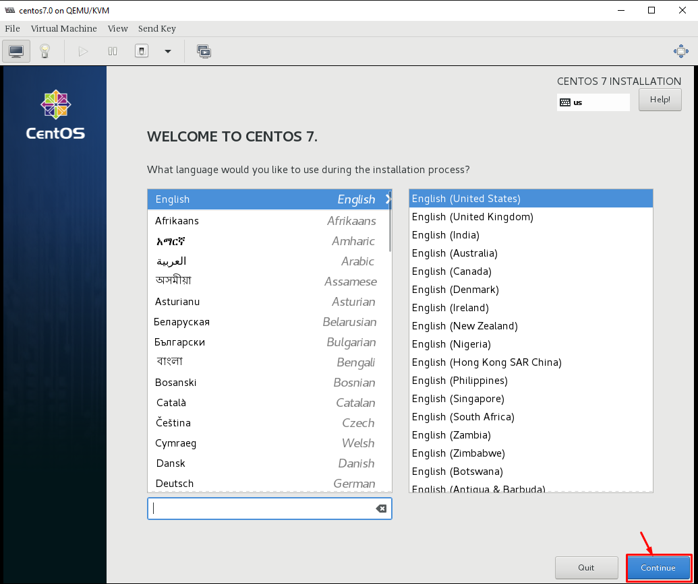
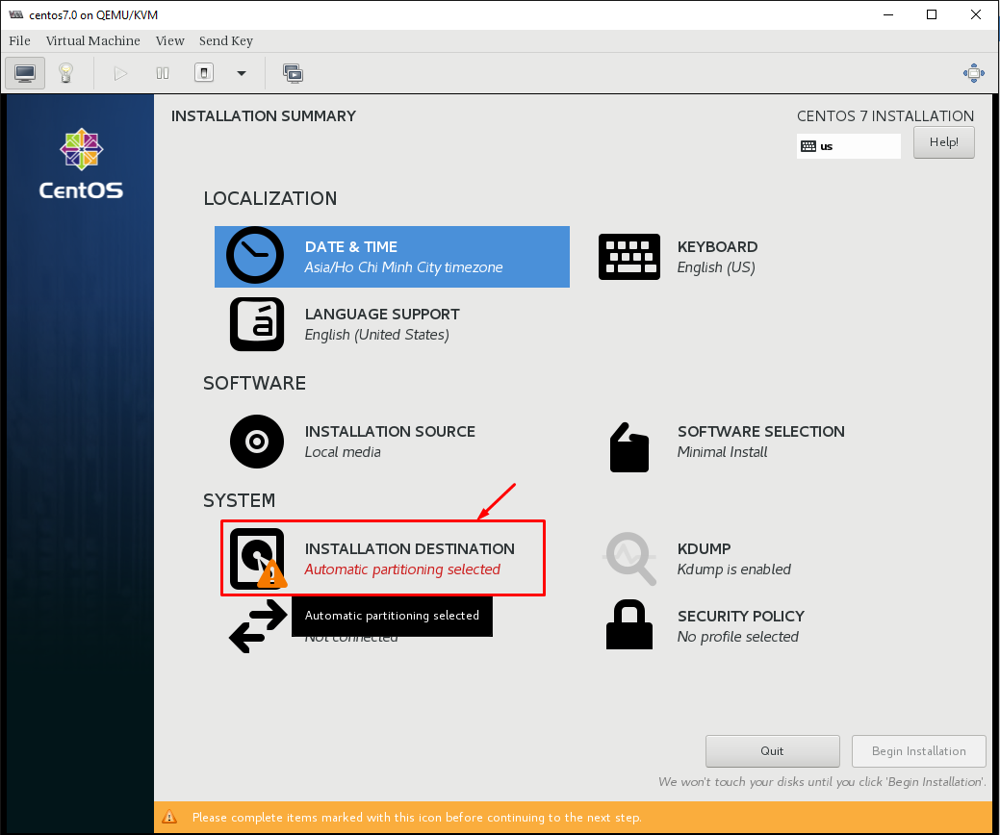
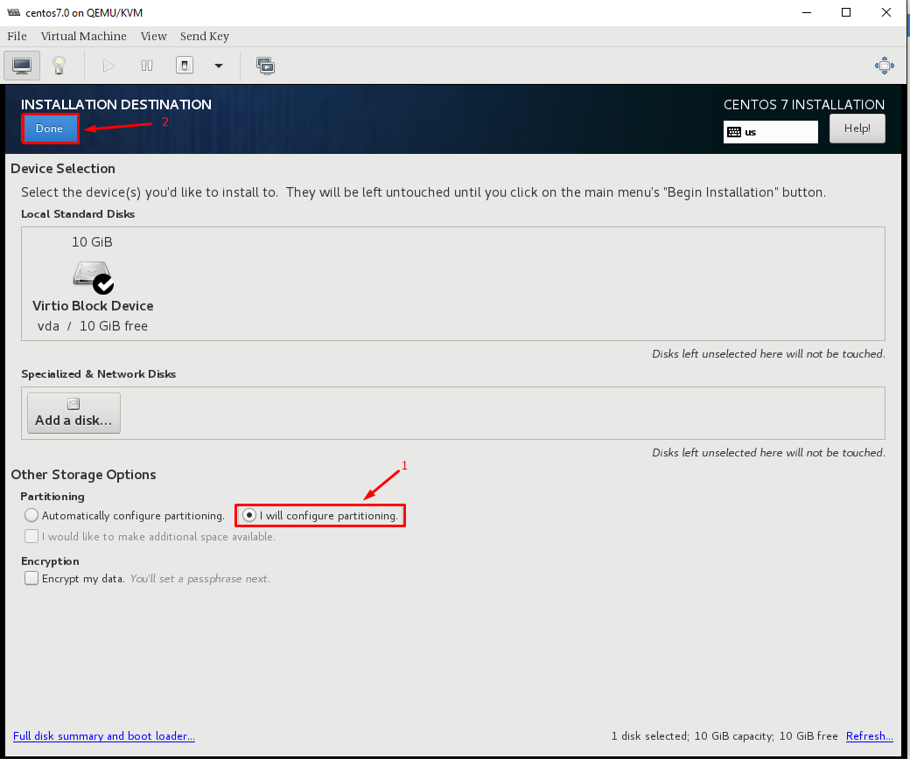
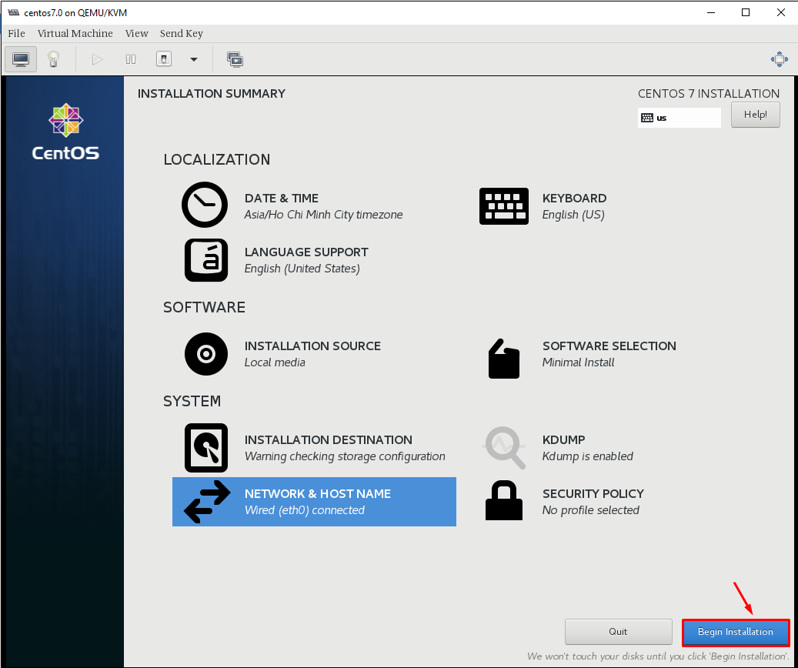
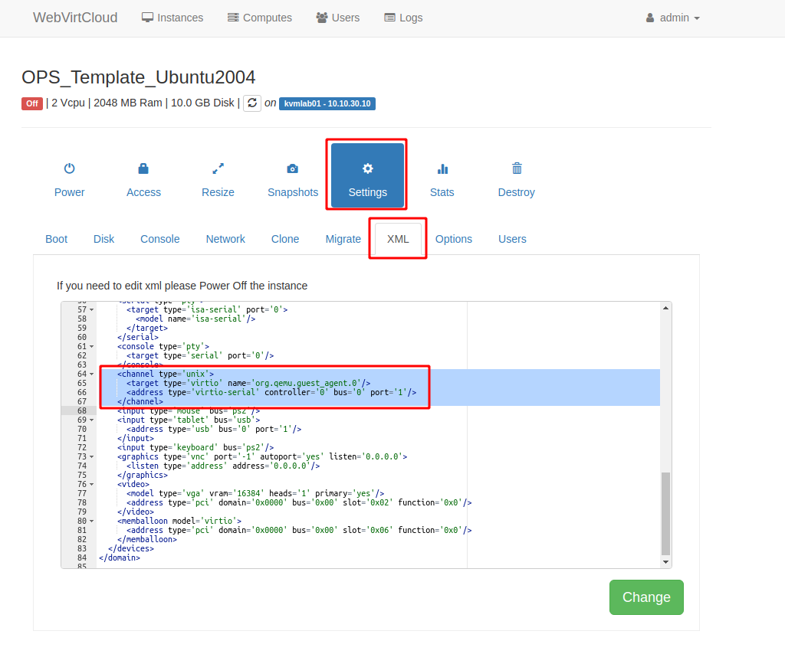

# Hướng dẫn đóng image CentOS7 với QEMU Guest Agent + cloud-init

### Chú ý trong quá trình đóng images

- KVM host đã được cài đặt sẵn sàng. [Cài đặt Môi trường để đóng images](Prepare.md)
- Đã có file iso của CentOS7
- Sử dụng `Standard` với định dạng `ext4` cho phân vùng OS không sử dụng LVM.
- Sử dụng công cụ virt-manager hoặc web-virt để kết nối tới console máy ảo
- Phiên bản OpenStack sử dụng là Queens
- Hướng dẫn bao gồm 2 phần chính: thực hiện trên máy ảo cài OS và thực hiện trên KVM Host
- Time zone VietNam

----------------------

## Phần 1: Cài đặt OS Centos 7

Chọn `Install CentOS7` để tiến hành cài đặt 


Cấu hình ngôn ngữ chọn `English(English)`



Cấu hình timezone về Ho_Chi_Minh


Cấu hình disk để cài đặt 





Chọn `Standard Partition` cho ổ disk 


Cấu hình mount point `/` cho toàn bộ disk


Định dạng lại `ext4` cho phân vùng


Kết thúc quá trình cấu hình disk 


Confirm quá trình chia lại partition cho disk 


Cấu hình network 


Turn on network cho interface và set hostname


Kết thúc cấu hình, bắt đầu quá trình cài đặt OS



Setup passwd cho root


Reboot lại VM sau khi cài đặt hoàn tất


Chỉnh sửa file XML VM
Lưu ý:
- Chỉnh sửa file .xml của máy ảo, bổ sung thêm channel trong (để máy host giao tiếp với máy ảo sử dụng qemu-guest-agent), sau đó save lại

Truy cập `Settings` > `XML` > `EDIT SETTINGS`



Nếu đã tồn tại channel đổi port channel này về port='2' và add channel bình thường


Định dạng
```
<devices>
<channel type='unix'>
    <target type='virtio' name='org.qemu.guest_agent.0'/>
    <address type='virtio-serial' controller='0' bus='0' port='1'/>
</channel>
</devices>
```

## Phần 2: Cài đặt môi trường
 
### 1. Cấu hình và cài đặt các gói
Cài đặt `epel-release` và update
```
yum install epel-release -y
yum update -y
yum install -y wget
```

### 2. Disable firewalld, SElinux
```
systemctl disable firewalld
systemctl stop firewalld

sed -i 's/SELINUX=enforcing/SELINUX=disabled/g' /etc/sysconfig/selinux
sed -i 's/SELINUX=permissive/SELINUX=disabled/g' /etc/sysconfig/selinux
sed -i 's/SELINUX=enforcing/SELINUX=disabled/g' /etc/selinux/config
sed -i 's/SELINUX=permissive/SELINUX=disabled/g' /etc/selinux/config
```

Reboot kiểm tra lại firewalld và SElinux

### 3. Cấu hình Network
Disable NetworkManager, sử dụng network service
```
systemctl disable NetworkManager
systemctl stop NetworkManager
systemctl enable network
systemctl start network
```

Disable IPv6:
```
echo "net.ipv6.conf.all.disable_ipv6 = 1" >> /etc/sysctl.conf
echo "net.ipv6.conf.default.disable_ipv6 = 1" >> /etc/sysctl.conf
sysctl -p
```

Kiểm tra
```
cat /proc/sys/net/ipv6/conf/all/disable_ipv6
```

Lưu ý: Kết quả ra `1` => Tắt thành công, `0` tức IPv6 vẫn bật

### 4. Cấu hình SSH
```
sed -i 's/#ListenAddress 0.0.0.0/ListenAddress 0.0.0.0/g' /etc/ssh/sshd_config 
sed -i 's/#PermitRootLogin yes/PermitRootLogin yes/g' /etc/ssh/sshd_config 
systemctl restart sshd
```

### 5. Điều chỉnh timezone
Đổi timezone về `Asia/Ho_Chi_Minh`
```
timedatectl set-timezone Asia/Ho_Chi_Minh
```
### 6. Cài đặt chronyd
```
yum install chrony -y
sed -i 's|server 1.vn.pool.ntp.org iburst|server 162.159.200.123 iburst|g' /etc/chrony.conf
systemctl enable --now chronyd 
hwclock --systohc
```

### 7. Cấu hình console và network

Để sử dụng nova console-log, bạn cần thay đổi option cho `GRUB_CMDLINE_LINUX` và lưu lại 

``` sh
sed -i 's/GRUB_CMDLINE_LINUX="crashkernel=auto rhgb quiet"/GRUB_CMDLINE_LINUX="crashkernel=auto console=tty0 console=ttyS0,115200n8"/g' /etc/default/grub
grub2-mkconfig -o /boot/grub2/grub.cfg
```
- Disable Default routing

``` sh
echo "NOZEROCONF=yes" >> /etc/sysconfig/network
```

- Xóa thông tin card mạng
``` sh
rm -f /etc/sysconfig/network-scripts/ifcfg-eth0
```

- Để sau khi boot máy ảo, có thể nhận đủ các NIC gắn vào:

```sh 
cat << EOF >> /etc/rc.local
for iface in \$(ip -o link | cut -d: -f2 | tr -d ' ' | grep ^eth)
do
   test -f /etc/sysconfig/network-scripts/ifcfg-\$iface
   if [ \$? -ne 0 ]
   then
       touch /etc/sysconfig/network-scripts/ifcfg-\$iface
       echo -e "DEVICE=\$iface\nBOOTPROTO=dhcp\nONBOOT=yes" > /etc/sysconfig/network-scripts/ifcfg-\$iface
       ifup \$iface
   fi
done
EOF
```

- Thêm quyền thực thi cho file `/etc/rc.local`
```sh
chmod +x /etc/rc.local 
```

- Xóa file hostname

``` sh
rm -f /etc/hostname
```

### 8. Tạo Snapshot Begin

## Phần 3. Cài đặt LAMP + Wordpress
### 1. Cài đặt Apache
- Install changelog
```
yum install yum-changelog
```
- Set up Repositories
```
cd /etc/yum.repos.d && wget https://repo.codeit.guru/codeit.el`rpm -q --qf "%{VERSION}" $(rpm -q --whatprovides redhat-release)`.repo
```
- Install the Apache 2.4
```
yum install httpd
```
- check version 
```
httpd -v
# Server version: Apache/2.4.46 (codeit)
# Server built:   Aug  7 2020 15:21:08
```
- Khởi động Apache
```
systemctl start httpd
systemctl enable httpd
systemctl status httpd
```
### 2. Cài đặt MariaDB
Mặc định, repo cài đặt MariaDB trên CentOS-7 là phiên bản 5.x. Vì vậy, để cài đặt bản mới cần chỉnh sửa repo cài MariaDB (phiên bản 10.5.6 - Stable)
```
vi /etc/yum.repos.d/MariaDB.repo
```
- Nội dung
```
# MariaDB 10.5 CentOS repository list - created 2020-10-14 04:31 UTC
# http://downloads.mariadb.org/mariadb/repositories/
[mariadb]
name = MariaDB
baseurl = http://yum.mariadb.org/10.5/centos7-amd64
gpgkey=https://yum.mariadb.org/RPM-GPG-KEY-MariaDB
gpgcheck=1
```

- Cài đặt MariaDB:
```
yum install MariaDB-server MariaDB-client -y
```

- Khởi động mariadb service:
```
systemctl start mariadb
systemctl enable mariadb
```

- Cài đặt một số thông tin ban đầu:
```
mysql_secure_installation
```


- Kiểm tra phiên bản:
```
mysql -V
mysql  Ver 15.1 Distrib 10.5.9-MariaDB, for Linux (x86_64) using readline 5.1
```

- Disable `unix_socket authentication`: Thêm đoạn sau vào file `/etc/my.cnf`
```
[mariadb]
unix_socket=OFF
```

- Restart service
```
systemctl restart mariadb
```
### 3. Cài đặt PHP
- Cài đặt PHP 7.4
```
yum install -y epel-release yum-utils
yum install -y http://rpms.remirepo.net/enterprise/remi-release-7.rpm
yum-config-manager --enable remi-php74
yum install -y php php-fpm php-common
yum install php-mysql php-gd php-xml php-mbstring php-opcache php-devel php-pear php-bcmath -y
```

- Kiểm tra lại phiên bản PHP
```
php -v

PHP 7.4.11 (cli) (built: Sep 29 2020 10:17:06) ( NTS )
Copyright (c) The PHP Group
Zend Engine v3.4.0, Copyright (c) Zend Technologies
    with Zend OPcache v7.4.11, Copyright (c), by Zend Technologies
```
### 4. Cài đặt Wordpress
#### **Tạo cơ sở dữ liệu và tài khoản cho Wordpress**

Đăng nhập vào tài khoản root của database:
```
mysql -u root -p
```

Tạo Database cho Wordpress. Đặt tên db là: `wp_db`
```sql
CREATE DATABASE wp_db;
```

Tạo tài khoản riêng để quản lí DB. Tên tài khoản: `wp_user`, Mật khẩu: `nhanhoa2020`
```sql
CREATE USER wp_user@localhost IDENTIFIED BY 'nhanhoa2020';
```

Bây giờ ta sẽ cấp quyền quản lí cơ sở dữ liệu cho user mới tạo:
```sql
GRANT ALL PRIVILEGES ON *.* TO wp_user@localhost IDENTIFIED BY 'nhanhoa2020';
```

Sau đó xác thực lại những thay đổi về quyền và thoát giao diện mariadb
```
FLUSH PRIVILEGES;

exit
```
Tải xuống WordPress phiên bản mới nhất: 
```
wget https://wordpress.org/latest.tar.gz
```

Giải nén file `latest.tar.gz`
```
tar xvfz latest.tar.gz
```
Tạo thư mục chứa `wordpress` và coppy code vào
```
mkdir /var/www/html/wordpress
cp -Rvf /root/wordpress/* /var/www/html/wordpress
```
#### **Cấu hình wordpress**
Tạo file cấu hình từ file mẫu:
```
cp /usr/share/nginx/html/wp-config-sample.php /usr/share/nginx/html/wp-config.php
```

Chỉnh sửa file cấu hình `wp-config.php`. Chỉnh lại tên database, username, password đã đặt ở trên. 
```
vi /var/www/html/wp-config.php
```
- `db_name`: `wp_db`,
- `username`: `wp_user`
- `pass`: `nhanhoa2020`

Xóa file wordpress giải nén đã tải về:
```
rm -rf /root/latest.tar.gz /root/wordpress/
```

#### **Phân quyền**
```
chown -R apache:apache /var/www/html/wordpress/*
```

### 5. Cấu hình thêm 
- Tạo file virtual hosts: `vi /etc/httpd/conf.d/httpd-vhosts.conf` có nội dung:

```
<VirtualHost *:80>
    ServerAdmin admin@localhost.local
    DocumentRoot /var/www/html/wordpress
    ServerName  localhost.local
    ServerAlias www.localhost.local
    <Directory "/var/www/html/wordpress">
        Options FollowSymLinks Indexes
        AllowOverride All
        DirectoryIndex index.php index.html default.php default.html
        Require all granted
        Allow from all
    </Directory>
    ErrorLog /var/log/httpd/wordpress/error.log
    CustomLog /var/log/httpd/wordpress/access.log combined
</VirtualHost>
```
- Tạo thư mục chưa file `log website wordpress`
```
mkdir /var/log/httpd/wordpress
```
- Tăng giới hạn dung lượng upload file

Chỉnh sửa file 
```
vi /etc/php.ini
```
Sửa các mục sau:
```conf
upload_max_filesize = 64M
post_max_size = 64M
```
### 6. Cài đặt PhpMyAdmin
- Cài đặt EPEL Repository
```
yum install epel-release
```
- Cài đặt PhpMyAdmin
```
yum install phpmyadmin
```
- phpMyAdmin.conf File
```
# Require ip 127.0.0.1
# Require ip ::1
Add line below: Require ip ::1
Require all granted

```
- restart Apache
```
Service httpd restart
```
- Update phiên bản phpmyadmin
```
cd /usr/share
wget https://files.phpmyadmin.net/phpMyAdmin/5.1.0/phpMyAdmin-5.1.0-all-languages.zip
mv phpMyAdmin phpMyAdmin.old
mv phpMyAdmin-5.1.0-all-languages phpMyAdmin
cd phpMyAdmin
mkdir tmp && chmod 777 tmp

```


### 7. Tạo file lưu thông tin mysql

```
vi /root/info.txt
```
Nội dung:
```
MySQL:
- root/nhanhoa2020
- wp_user/nhanhoa2020
```

### 8. Tạo Snapshot CentOS7-Wordpress-LAMP

## Phần 4. Cài đặt một số dịch vụ cần thiết cho Template
- Cài đặt acpid nhằm cho phép hypervisor có thể reboot hoặc shutdown instance.
    ```
    yum install acpid -y
    systemctl enable acpid
    ```

- Cài đặt qemu guest agent, kích hoạt và khởi động qemu-guest-agent service
    ```
    yum install -y qemu-guest-agent
    systemctl enable qemu-guest-agent.service
    systemctl start qemu-guest-agent.service
    ```

**Lưu ý:**

- Để sử sụng qemu-agent, phiên bản selinux phải > 3.12
    ```
    rpm -qa | grep -i selinux-policy
    ```
- Để có thể thay đổi password máy ảo thì phiên bản qemu-guest-agent phải >= 2.5.0
    ```
    qemu-ga --version
    ```
- Cài đặt CMDlog và  welcome Display
```
curl -Lso- https://raw.githubusercontent.com/nhanhoadocs/ghichep-cmdlog/master/cmdlog.sh | bash
wget https://raw.githubusercontent.com/danghai1996/create-images-openstack/master/scripts_all/linux-login.sh -O /etc/profile.d/linux-login.sh && chmod +x /etc/profile.d/linux-login.sh

```
Log out rồi login lại kiểm tra:
  - Log cmd: /var/log/cmdlog.log
  - Giao diện sau khi login:
      ```
    Welcome to Cloud365 | nhanhoa.com

    Tue 23 Mar 2021 03:04:17 PM +07

    ______ __                   __ _____  _____  ______
    / ____// /____   __  __ ____/ /|__  / / ___/ / ____/
    / /    / // __ \ / / / // __  /  /_ < / __ \ /___ \
    / /___ / // /_/ // /_/ // /_/ / ___/ // /_/ /____/ /
    \____//_/ \____/ \__,_/ \__,_/ /____/ \____//_____/

    * Trang chu NhanHoa : https://nhanhoa.com/
    * Cloud365          : https://cloud365.vn/
    * Portal            : https://portal.cloud365.vn/
    * Huong dan su dung : https://support.cloud365.vn/
    * Email ho tro      : support@nhanhoa.com

    *----------------------------------------------------*

    root@cloud:~# 
    ```
Kiểm tra lỗ hổng CVE-2021 và dọn dẹp
```
sudoedit -s /
```
- Kết quả trả ra như sau:
```
TH1: "sudoedit: /: not a regular file" -> sudo có lỗ hổng
TH2:  "usage: sudoedit [-AknS] [-r role] [-t type] [-C num] [-g group] [-h host] [-p prompt] [-T timeout] [-u user] file" -> sudo đã được vá.
```

- Cài đặt cloud-init và cloud-utils:
    ```
    yum install -y cloud-init cloud-utils
    ```
    Để máy ảo trên OpenStack có thể nhận được Cloud-init cần thay đổi cấu hình mặc định bằng cách sửa đổi file `/etc/cloud/cloud.cfg`.
    ```
    sed -i 's/disable_root: 1/disable_root: 0/g' /etc/cloud/cloud.cfg
    sed -i 's/ssh_pwauth:   0/ssh_pwauth:   1/g' /etc/cloud/cloud.cfg
    sed -i 's/name: centos/name: root/g' /etc/cloud/cloud.cfg
    ```
- Clean all
    ```
    yum clean all

    rm -f /var/log/wtmp /var/log/btmp

    rm -f /root/.bash_history

    > /var/log/cmdlog.log

    history -c
    ```

> ## Tắt VM -> Snapshot: Final
## Phần 5: Xử lý image trên KVM host
###  Sử dụng lệnh virt-sysprep để xóa toàn bộ các thông tin máy ảo
```
virt-sysprep -d ThangNV_WP-LAMP
```

### Tối ưu kích thước image:
```
virt-sparsify --compress --convert qcow2 /var/lib/libvirt/images/ThangNV_WP-LAMP.qcow2 ThangNV_WP-LAMP.qcow2
```

### Upload image lên glance và sử dụng
```
glance image-create --container-format bare --visibility=public \
--name ThangNV_WP-LAMP --disk-format raw \
--file /root/image-create-ops-test/ThangNV_WP-LAMP.raw --visibility=public \
--property os_type=linux \
--property hw_qemu_guest_agent=yes \
--property vps_image_user=root \
--property vps_image_type=CentOS \
--property vps_image_app=true \
--min-disk 10 --min-ram 1024 --progress
```
