# Hướng dẫn đóng Image Ubuntu 16.04 với cloud-init và QEMU Guest Agent( không dùng LVM)

- Chú ý:
  - Sử dụng cho các Image không dùng LVM
  - Sử dụng công cụ virt-manager hoặc web-virt để kết nối tới console máy ảo
  - OS cài đặt KVM là Ubuntu 16.04
  - Phiên bản OpenStack sử dụng là Queens
  - Hướng dẫn bao gồm 2 phần chính: thực hiện trên máy ảo cài OS và thực hiện trên KVM Host

## I. Tạo máy ảo trên WebvirtCloud
### 1. Thêm VM 
Bước 1: Tạo 1 storage để chạy VM. 
- Chúng ta chọn `Computer` 

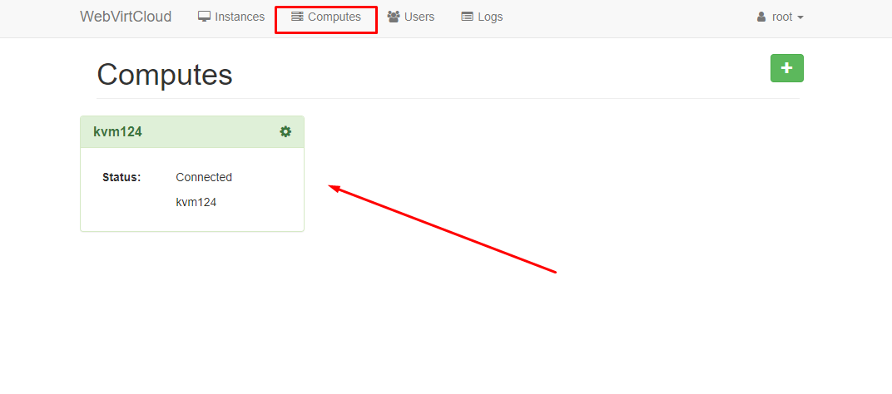

- Tại giao diện `kvm124` ta chọn phần `storages` sau đó chọn phân vùng tạo VM.

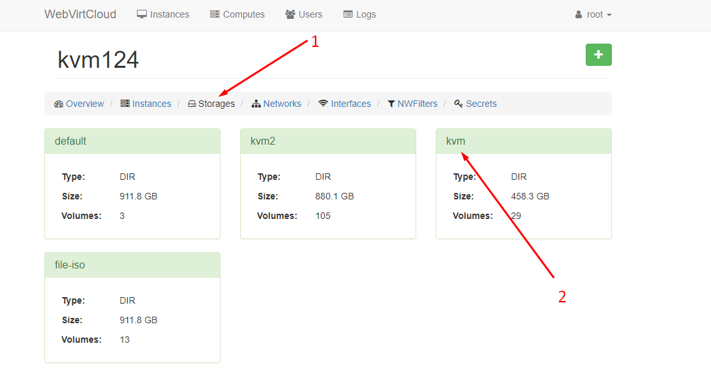

- Click chọn biểu tượng `+ `để thêm Volume: 

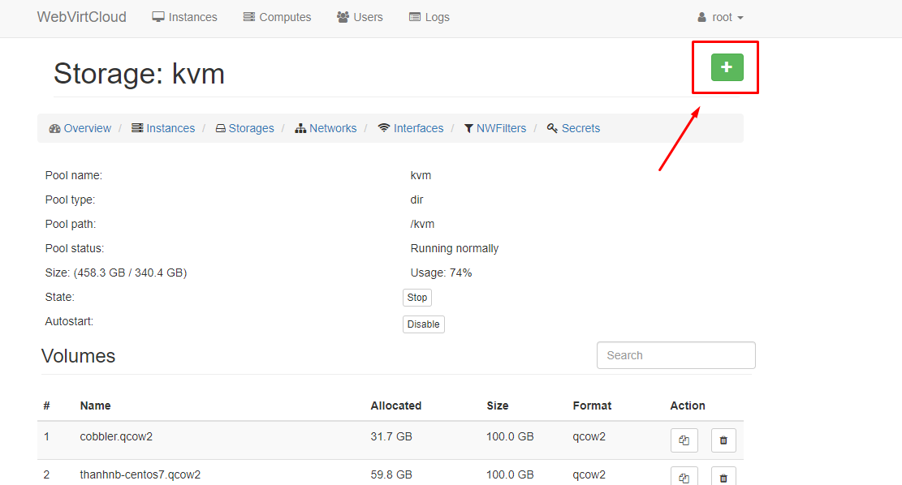

- Tiến hành đặt tên, chọn định dạng và chọn dung lượng cho VM. Sau khi hoàn thành bấm chọn `Create` để tạo Storage cho VM.

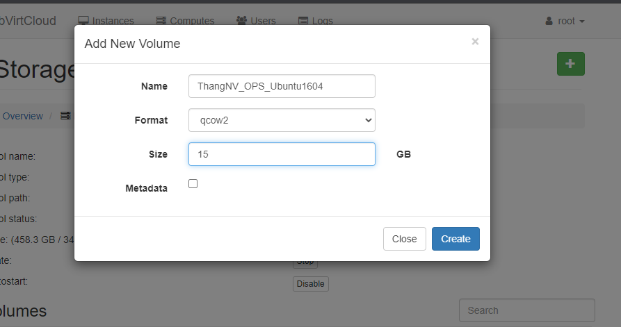

- Thông báo sau khi hoàn thành: 

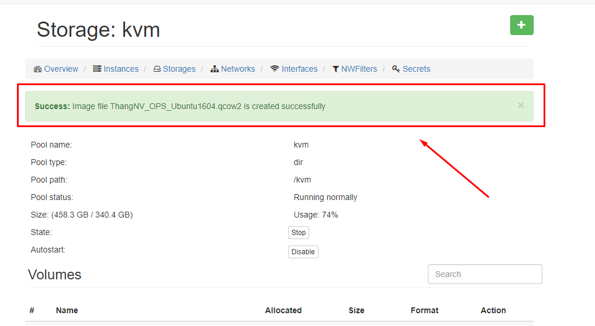

Bước 2: Tạo VM

- Vào ` Instances` tích vào dấu `+` để tạo mới VM

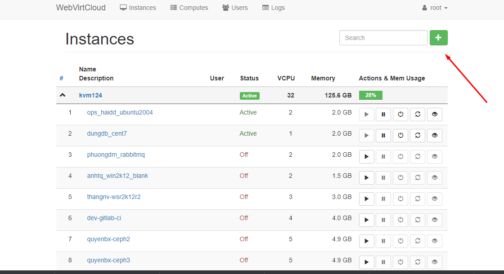

- Chọn ` Custom ` hoặc những mấu có sắm

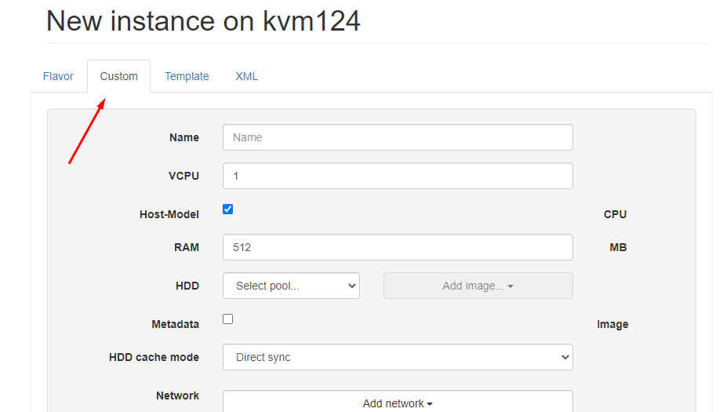

- Tiến hành đặt ` teen`, chọn cấu hình `CPU` và `Ram`.

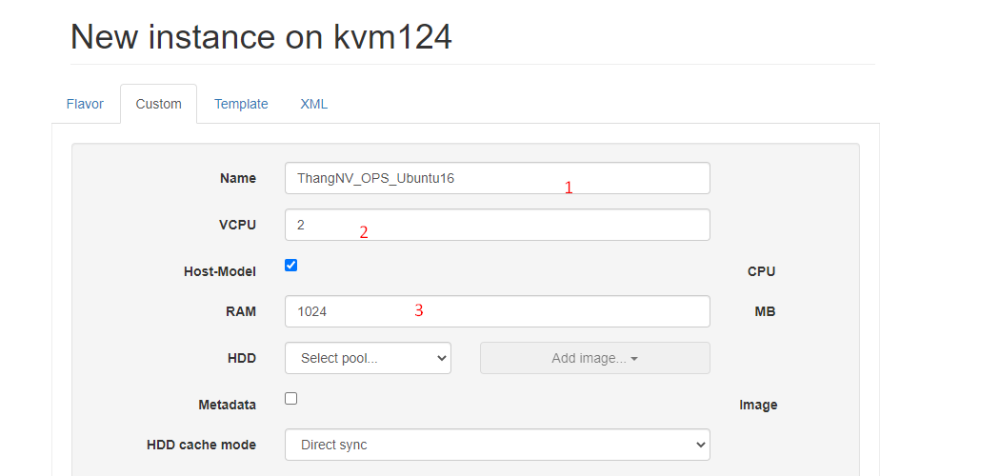

- Tại phần HDD, ta chọn volume đã tạo ở trên để tạo VM. Ở đây chọn vào `Storage` đã tạo trước đó ở bước 1:


- Chọn Network. Rồi click `Create`

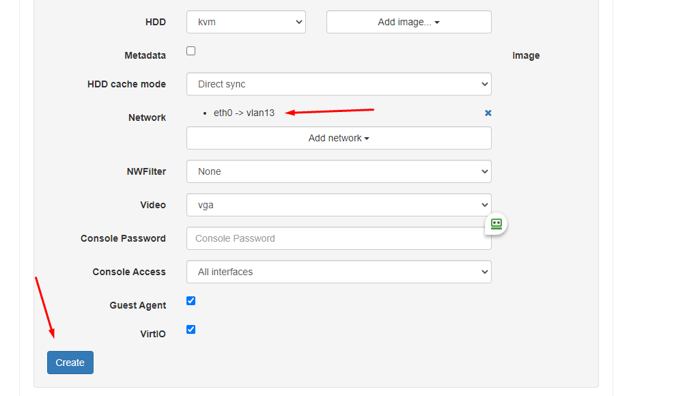

Bước 3: Sau khi thành công sẽ hiển thị giao diện bên dưới. Chọn `Setting`

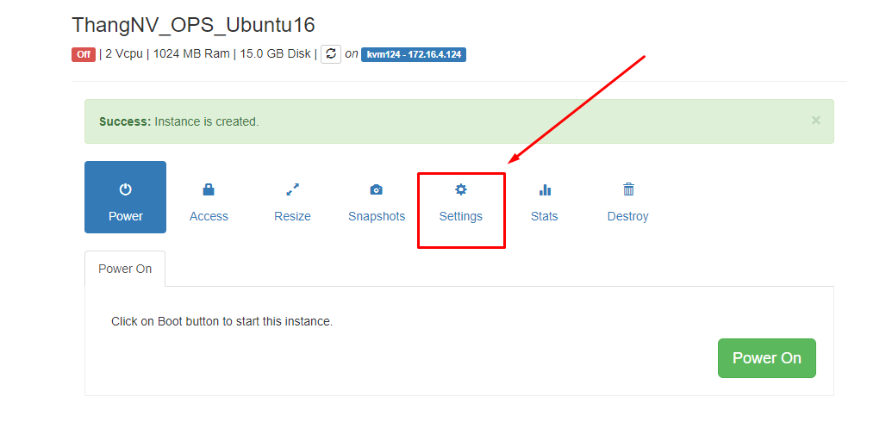

- Tiếp theo tiến hành chọn `Disk` và file `ISO` để tiến hành `Mount` và cài đặt `OS`


- Sang mục `Boot`. Tại mục `Boot Order`, ta sẽ chọn 2 phần `vda`, `hda`rồi click `Apply`


### 2. Setup OS Ubuntu 16.04

Bước 1: Quay sang màn hình `Power` bấm chọn `Power on`. Sau đó tích chọn ` Access` và chọn ` Console`
- `Power on`


- ` Console`


Bước 2: Tiến hành cài đặt


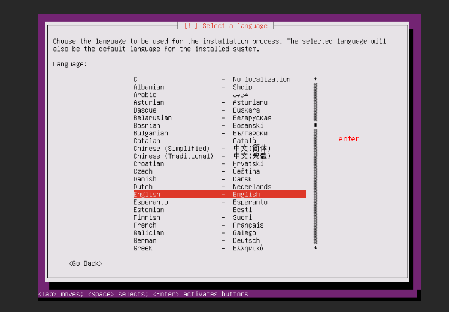


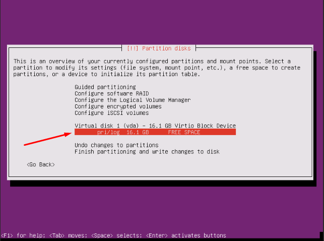


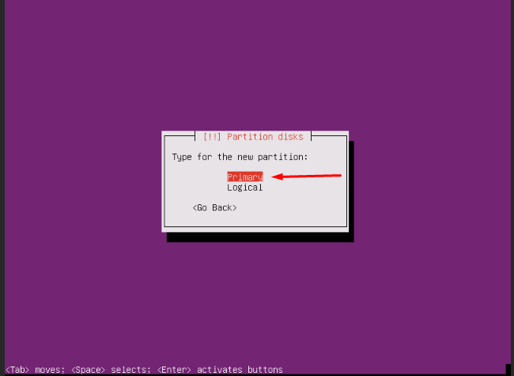


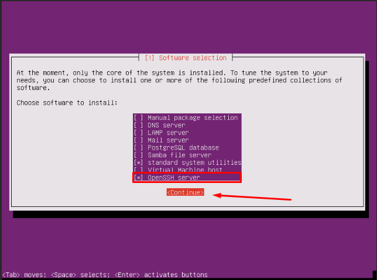


Bước 3: Tắt máy ảo, xử lí trên KVM host
- Shutdown máy để thực hiện remove CDROM


- Vào `Setting` chọn lại `Boot order`


- Chỉnh sửa file .xml của máy ảo, bổ sung thêm channel trong (để máy host giao tiếp với máy ảo sử dụng qemu-guest-agent), sau đó save lại

  - Nội dung bổ sung: 

```
<devices>
 <channel type='unix'>
      <target type='virtio' name='org.qemu.guest_agent.0'/>
      <address type='virtio-serial' controller='0' bus='0' port='1'/>
 </channel>
</devices>
```


> Nếu đã tồn tại `channel` đổi port channel này về `port='2'` và add channel bình thường


### 3. Cài đặt và thiết lập các dịch vụ
Bước 1: Thiết lập SSH
- Login ssh với tài khoản `ubuntu`, chuyển sang user `root`
```
sudo su
```
- Đặt mật khẩu cho `root`
```
passwd root
Enter new UNIX password: <root_passwd>
Retype new UNIX password: <root_passwd>
```
- Cấu hình cho phép ssh bằng user `root` trong file `/etc/ssh/sshd_config`

```
PermitRootLogin yes
service sshd restart
```
- Xóa user ubuntu:
```
userdel ubuntu
rm -rf /home/ubuntu
```
- Disable firewalld
```
sudo apt-get install ufw -y
systemctl disable ufw
systemctl stop ufw
systemctl status ufw
```
- Disable ipv6
```
echo "net.ipv6.conf.all.disable_ipv6 = 1" >> /etc/sysctl.conf 
echo "net.ipv6.conf.default.disable_ipv6 = 1" >> /etc/sysctl.conf 
echo "net.ipv6.conf.lo.disable_ipv6 = 1" >> /etc/sysctl.conf
> Kiểm tra config add thành công 
sysctl -p
> Kiểm tra disable ipv6 
cat /proc/sys/net/ipv6/conf/all/disable_ipv6
> Output: 1: OK, 0: NotOK
```
- Khởi động lại

```
init 6
```
Bước 2: Điều chỉnh Timezone
- Đổi timezone về Asia/Ho_Chi_Minh
```
timedatectl set-timezone Asia/Ho_Chi_Minh
```
- Bổ sung env locale
```
echo "export LC_ALL=C" >>  ~/.bashrc
```
- Cài đặt Chronyd
```
apt install chrony -y
sed -i 's|pool 1.asia.pool.ntp.org offline iburst|pool 212.26.18.43 offline iburst|g' /etc/chrony/chrony.conf
service chrony restart
hwclock --systohc
```

- Cập nhật gói, update OS
```
sudo apt-get update -y 
sudo apt-get upgrade -y 
sudo apt-get dist-upgrade -y
sudo apt-get autoremove 
```
Bước 3: Cấu hình Card mạng
- Cấu hình để đổi name Card mạng về eth* thay vì ens, eno (Để scripts netplug chạy ổn định)
```
sed -i 's|GRUB_CMDLINE_LINUX=""|GRUB_CMDLINE_LINUX="net.ifnames=0 biosdevname=0"|g' /etc/default/grub
```
- Lưu lại config
```
update-grub
```
- Reboot VM
```
init 6
```
- Login *Console và chỉnh card mạng về đúng eth0 trong /etc/network/interfaces
```
cat << EOF > /etc/network/interfaces
auto lo
iface lo inet loopback
auto eth0
iface eth0 inet dhcp
EOF

```


- Cập nhật nameserver DNS tại file `/etc/resolv.conf`
```
nameserver 8.8.8.8
```

- Thực hiện restart network
```
/etc/init.d/networking restart 
```

Bước 4: tắt máy `Snapshot` lại để lưu trữ và đóng gói lại khi cần thiết
- Shutdown VM


- Snapshot


Bước 5: gỡ cài đặt cloud-init và snap

- Gỡ cài đặt cloud-init
```
sudo apt-get purge cloud-init
rm -rf /etc/cloud/
rm -rf /var/lib/cloud/
```
- Gỡ cài đặt Snap
  - Để xóa, ta sử dụng lệnh snap remove <package>: lxd -> core18 -> snapd
```
snap remove lxd
snap remove core18
snap remove snapd
```
  - Remove snapd package
```
apt purge snapd -y
```
  - Xóa các thự mục snap
```
rm -rf ~/snap
rm -rf /snap
rm -rf /var/snap
rm -rf /var/lib/snapd
```
Bước 6: Thiết lập gói cloud-init
- Cài đặt cloud-init
```
apt-get install cloud-utils cloud-initramfs-growroot cloud-init -y
```
- Cấu hình user mặc định
```
sed -i 's/name: ubuntu/name: root/g' /etc/cloud/cloud.cfg
```
- Disable default config route
```
sed -i 's|link-local 169.254.0.0|#link-local 169.254.0.0|g' /etc/networks
```
- Cấu hình datasource, bỏ chọn mục NoCloud bằng cách dùng dấu SPACE, sau đó ấn ENTER
```
dpkg-reconfigure cloud-init
```

- Disable Warning đối với EC2 trên Ubuntu 16
```
touch /root/.cloud-warnings.skip
```
- Clean cấu hình và restart service
```
cloud-init clean
systemctl restart cloud-init
systemctl enable cloud-init
systemctl status cloud-init
```
*Lưu ý:* Việc restart có thể mất 2-3 phút hoặc hơn (Nếu quá lâu có thể bỏ qua bước restart cloud-init)

Bước 7: Xóa bỏ thông tin của địa chỉ MAC

- Xóa nội dung file net rules
```
echo > /lib/udev/rules.d/75-persistent-net-generator.rules
echo > /etc/udev/rules.d/70-persistent-net.rules

```
Bước 8: Cấu hình để instance báo log ra console
```
sed -i 's|GRUB_CMDLINE_LINUX_DEFAULT=""|GRUB_CMDLINE_LINUX_DEFAULT="console=tty0 console=ttyS0,115200n8"|g' /etc/default/grub

```
- Lưu lại config
```
update-grub
```
Bước 9: Cài đặt netplug để sau khi boot máy ảo, có thể nhận đủ các NIC gắn vào:
```
apt-get install netplug -y
wget https://raw.githubusercontent.com/uncelvel/create-images-openstack/master/scripts_all/netplug_ubuntu -O netplug
mv netplug /etc/netplug/netplug
chmod +x /etc/netplug/netplug
```
Bước 10: Cài đặt qemu-guest-agent

*Chú ý:* qemu-guest-agent là một daemon chạy trong máy ảo, giúp quản lý và hỗ trợ máy ảo khi cần (có thể cân nhắc việc cài thành phần này lên máy ảo)
- Để có thể thay đổi password máy ảo thì phiên bản qemu-guest-agent phải >= 2.5.0
```
apt-get install software-properties-common -y
add-apt-repository cloud-archive:mitaka -y
apt-get update
apt-get install qemu-guest-agent -y
```
- Kiểm tra phiên bản qemu-ga bằng lệnh:
```
qemu-ga --version
service qemu-guest-agent status
```
- Kết quả:
```
QEMU Guest Agent 2.11.0
* qemu-ga is running
```
Bước 11: Cài đặt CMDlog và  welcome Display
```
curl -Lso- https://raw.githubusercontent.com/nhanhoadocs/ghichep-cmdlog/master/cmdlog.sh | bash
wget https://raw.githubusercontent.com/danghai1996/create-images-openstack/master/scripts_all/linux-login.sh -O /etc/profile.d/linux-login.sh && chmod +x /etc/profile.d/linux-login.sh

```
- Log out rồi login lại kiểm tra:
  - Log cmd: /var/log/cmdlog.log
  - Giao diện sau khi login:
      ```
    Welcome to Cloud365 | nhanhoa.com

    Tue 23 Mar 2021 03:04:17 PM +07

    ______ __                   __ _____  _____  ______
    / ____// /____   __  __ ____/ /|__  / / ___/ / ____/
    / /    / // __ \ / / / // __  /  /_ < / __ \ /___ \
    / /___ / // /_/ // /_/ // /_/ / ___/ // /_/ /____/ /
    \____//_/ \____/ \__,_/ \__,_/ /____/ \____//_____/

    * Trang chu NhanHoa : https://nhanhoa.com/
    * Cloud365          : https://cloud365.vn/
    * Portal            : https://portal.cloud365.vn/
    * Huong dan su dung : https://support.cloud365.vn/
    * Email ho tro      : support@nhanhoa.com

    *----------------------------------------------------*

    root@cloud:~# 
    ```
Bước 12: kiểm tra lỗ hổng CVE-2021 và dọn dẹp
```
sudoedit -s /
```
- Kết quả trả ra như sau:
```
TH1: "sudoedit: /: not a regular file" -> sudo có lỗ hổng
TH2:  "usage: sudoedit [-AknS] [-r role] [-t type] [-C num] [-g group] [-h host] [-p prompt] [-T timeout] [-u user] file" -> sudo đã được vá.
```
- Clear toàn bộ history
```
apt-get clean all
rm -f /var/log/wtmp /var/log/btmp
> /var/log/cmdlog.log
history -c

```
- Tắt VM
```
init 0
```
Bước 13: tạo Snapshot (U16Blank)

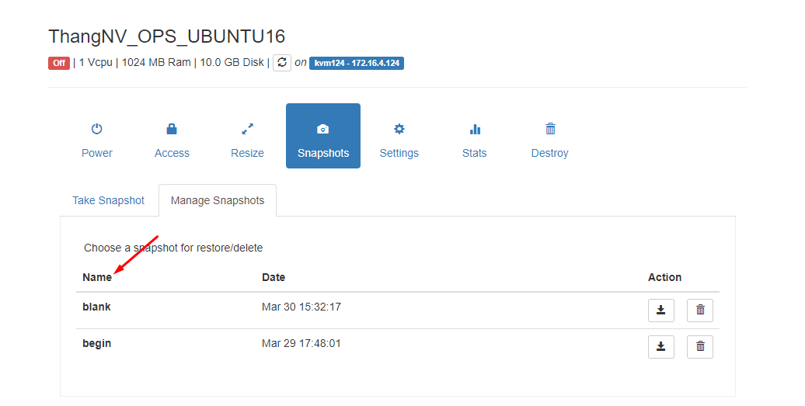


## 3. Nén Image Ubuntu 16.04 và tạo Image trên Openstack

Bước 1: Xử dụng lệnh virt-sysprep để xóa toàn bộ các thông tin máy ảo
```
virt-sysprep -d ThangNV_OPS_Ubuntu16
```

Bước 2: Tối ưu kích thước image:
```
virt-sparsify --compress --convert qcow2 /var/lib//kvm/ThangNV_OPS_Ubuntu1604.qcow2 U1604-Blank
```
Bước 3: Upload image lên glance và sử dụng

```
glance image-create --name ThangNV_OPS_template_Ubuntu_16.04 \
--file /root/image-create-ops-test/ThangNV_OPS_template_Ubuntu_16.04.raw \
--disk-format raw \
--container-format bare \
--visibility=public \
--property hw_qemu_guest_agent=yes \
--min-disk 10 --min-ram 1024 --progress
```


