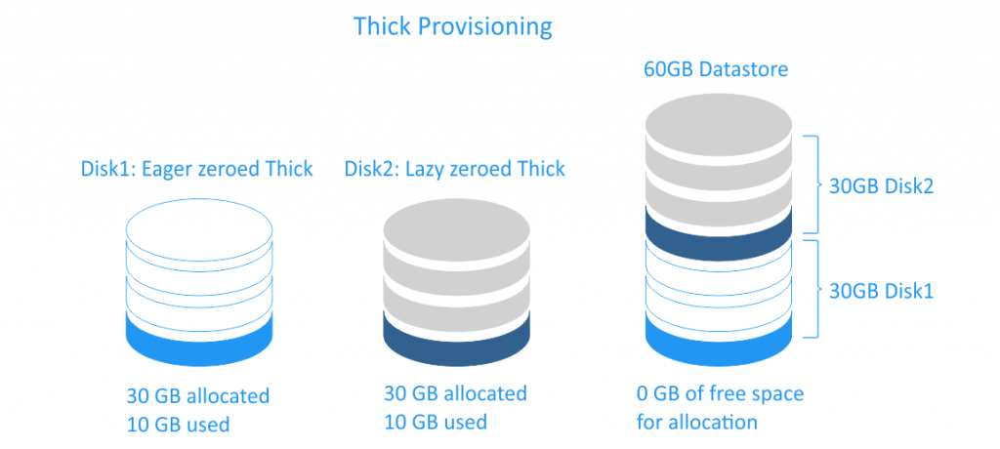

# Phân biệt thin provisioning và thick provisioning

## Mục lục

[1, Thick provisioning](https://github.com/thang290298/work-Document/blob/master/KVM/Dosc/thick-tin-provisioning-KVM.md#1-thick-provisioning)

[2, Thin Provisioning](https://github.com/thang290298/work-Document/blob/master/KVM/Dosc/thick-tin-provisioning-KVM.md#2-thin-provisioning)

[3, Tài liệu tham khảo](https://github.com/thang290298/work-Document/blob/master/KVM/Dosc/thick-tin-provisioning-KVM.md#3-t%C3%A0i-li%E1%BB%87u-tham-kh%E1%BA%A3o)

Khi khởi tạo VM (Virtual Machine) có bước lựa chọn định dạng phân vùng lưu trữ cho VM như: Thin Provisioned, Thick Provisioned Lazy Zeroe & Thick Provisioned Eager Zeroed. Để VM đạt được hiệu năng tốt nhất để đáp ứng nhu cầu riêng biệt cho VM bạn phải hiểu và chọn định dạng phân vùng phù hợp.

Đặc biết khác biết nhất giữa Thin - Thick Provisioning là cách chiếm dụng và sử dụng disk
## 1. Thick provisioning

Với thick Provisioning, dung lượng lưu trữ trên đĩa ảo được phân bổ trước trên bộ nhớ vật lý khi đĩa ảo được tạo
Đĩa ảo được cấp thick Provisioning sử dụng và chiếm đoạt tất cả dung lượng bộ nhớ được cấp phát ngay từ ban đầu, sẽ không tồn tại không gian trống cho các máy ảo khác
- Có 2 kiểu của thick-provisioned virtual disks

	+ Lazy zeroed disk: là một đĩa ảo sử dụng tất cả không gian đĩa  tại thời điểm khởi tạo, nhưng có thể không gian này có thể chuwas một số dung lượng cũ  trên phương tiện vạt lý. Các dữ liệu cũ không bị xóa hoặc ghi đè lên nên nó cần phải xóa dữ liệu cũ trước khi ghi dữu liệu mới. Với loại đĩa này có thể khởi tạo nhanh hơn nhưng hiệu suất sẽ thấp hơn trong lần ghi đầu tiên.

	+ Eager zeroed disk: là đĩa ảo được nhận tất cả dung lượng cần thiết tại thời điểm tạo vào xóa sạch không gian bộ nhớ với mọi dữ liệu có trên phương tiện vật lý.Việc tạo đĩa sẽ mất thời gian hơn vì các số 0 sẽ được ghi vào toàn bộ đĩa , những hiệu suất sẽ nhanh hơn trong lần ghi dữ liệu đầu tiên

Thick Provisioned Eager Zeroed cũng giống như Full Format định dạng này thực hiện việc ghi giá trị 0 lên tất cả sector, đồng nghĩa việc sao chép dữ liệu vào sẽ chỉ việc ghi thêm giá trị 1 lên. 
Thick Provisioned Lazy Zeroe thì như Quick Format, sao chép dự liệu đến đâu sẽ ghi đến đó.

Vì lý do bảo mật dữ liệu, eager zeroing là phổ biến hơn so với lazy zeroing trong thick-provisioned virtual disks. Khi bạn xóa một file disk máy ảo (vmdk), dữ liệu trên datastore không bị xóa hoàn toàn, các block được đánh dấu là available, cho đến khi hệ điều hành ghi đè chúng. Nếu bạn muốn tạo eager zeroed muốn trên datastore, vùng đĩa sẽ bị xóa hoàn toàn (nghĩa là zeroed), do đó ngăn chặn bất kỳ ai có ý định xấu có thể khôi phục dữ liệu trước đó - ngay cả khi họ sử dụng phần mềm chuyên dụng của bên thứ ba.

## 2. Thin Provisioning

Thin provisioning là một loại phân bổ trước bộ nhớ khác. Đĩa ảo được tạo kiểu thin provisioning chỉ tiêu thụ không gian cần thiết ban đầu và tăng theo thời gian theo nhu cầu.
Ví dụ: Nếu tạo một đĩa ảo 30GB mới thin provisioning và sao chép 10 GB tệp, kích thước của tệp VMDK kết quả sẽ là 10 GB, trong khi bạn sẽ có tệp VMDK 30 GB nếu đã chọn sử dụng đĩa được tạo thick provisioning.

Các đĩa ảo thin provisioning nhanh chóng tạo và hữu ích để tiết kiệm dung lượng lưu trữ. Hiệu suất của một đĩa được cấp thin provisioning không cao hơn ổ đĩa lazy zeroed thick-provisioned  bởi vì đối với cả hai loại đĩa này, các số 0 phải được ghi trước khi ghi dữ liệu vào một khối mới. Lưu ý rằng khi xóa dữ liệu của mình khỏi ổ đĩa ảo được cấp thin provisioning, kích thước đĩa sẽ không tự động giảm. Điều này là do hệ điều hành chỉ xóa các chỉ mục từ bảng tệp tham chiếu đến phần thân tệp trong hệ thống tệp; nó đánh dấu các khối thuộc về các tệp "đã xóa" là free và có thể truy cập được để ghi dữ liệu mới. 

Hiệu suất thì Thick Provisioned Eager Zeroed sẽ có hiệu suất tốt nhất, sau đó đến Thick Provisioned Lazy Zeroe và sau cùng là Thin Provisioned.

## 3. Tài liệu tham khảo

https://www.nakivo.com/blog/thick-and-thin-provisioning-difference/