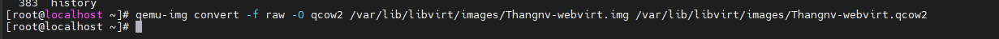

# Mục Lục

[I. Tổng quan về file image trong KVM](https://github.com/thang290298/work-Document/blob/master/KVM/Document/file-images-trong-kvm.md#i-t%E1%BB%95ng-quan-v%E1%BB%81-file-image-trong-kvm)

[II. Định dạng file image phổ biến trong KVM](https://github.com/thang290298/work-Document/blob/master/KVM/Document/file-images-trong-kvm.md#ii-%C4%91%E1%BB%8Bnh-d%E1%BA%A1ng-file-image-ph%E1%BB%95-bi%E1%BA%BFn-trong-kvm)

  [1. File ISO](https://github.com/thang290298/work-Document/blob/master/KVM/Document/file-images-trong-kvm.md#1-file-iso)

  [2. File raw](https://github.com/thang290298/work-Document/blob/master/KVM/Document/file-images-trong-kvm.md#2-file-raw)

  [3 File qcow2](https://github.com/thang290298/work-Document/blob/master/KVM/Document/file-images-trong-kvm.md#3-file-qcow2)

[III. Chuyển đổi giữa raw và qcow2](https://github.com/thang290298/work-Document/blob/master/KVM/Document/file-images-trong-kvm.md#iii-chuy%E1%BB%83n-%C4%91%E1%BB%95i-gi%E1%BB%AFa-raw-v%C3%A0-qcow2)

[IV. Tài liệu tham khảo](https://github.com/thang290298/work-Document/blob/master/KVM/Document/file-images-trong-kvm.md#iv-t%C3%A0i-li%E1%BB%87u-tham-kh%E1%BA%A3o)


# I. Tổng quan về file image trong KVM
- File Image (còn gọi là file ảnh) của đĩa CD/DVD chính là một dạng file có định dạng theo các chuẩn tạo file ảnh. File image là một file đóng gói hết tất cả nội dung của một đĩa CD/DVD vào trong nó.
- Trong KVM Guest có 2 thành phần chính đó là VM definition được lưu dưới dạng file xml tại `/etc/libvirt/qemu`. File này chứa các thông tin của máy ảo như tên, thông tin về tài nguyên của VM (RAM, CPU)… File còn lại là storage thường được lưu dưới dạng file image tại thư mục `/var/lib/libvirt/images`.
- 3 định dạng thông dụng nhất của file image sử dụng trong KVM đó là `ISO`, `raw` và `qcow2`.

# II. Định dạng file image phổ biến trong KVM
## 1. File ISO
- File ISO là file ảnh của 1 đĩa CD/DVD, nó chứa toàn bộ dữ liệu của đĩa CD/DVD đó. File ISO thường được sử dụng để cài đặt hệ điều hành vủa VM, người dùng có thể import trực tiếp hoặc tải từ trên internet về.
- Boot từ file ISO cũng là một trong số những tùy chọn mà người dùng có thể sử dụng khi tạo máy ảo.
## 2. File raw
- Là định dạng file image phi cấu trúc
- khi người dùng tạo mới một máy ảo có disk format là `raw` thì dung lượng của file disk sẽ bằng dung lượng ổ đĩa máy ảo đã tạo
- Định dang của `raw` là image theo dạng nhị phân ( bit by bit) của ổ đĩa
- khi khởi tạo máy ảo với virt-manager hoặc không khai báo khi tạo máy ảo bằng Virt-install thì định dạng ổ là raw, raw là định dạng mặc định của QEMU
## 3 File qcow2
- qcow là một định dạng tập tin cho đĩa hình ảnh các tập tin được sử dụng bởi QEMU , một tổ chức màn hình máy ảo . Nó viết tắt của “QEMU Copy On Write ” và sử dụng một chiến lược tối ưu hóa lưu trữ đĩa để trì hoãn phân bổ dung lượng lưu trữ cho đến khi nó thực sự cần thiết. Các tập tin trong định dạng qcow có thể chứa một loạt các hình ảnh đĩa thường được gắn liền với khách cụ thể các hệ điều hành . Hai phiên bản của các định dạng tồn tại: qcow, và qcow2, trong đó sử dụng các .qcow và .qcow2 mở rộng tập tin, tương ứng.
- Qcow2 là một phiên bản cập nhật của định dạng qcow, nhằm để thay thế nó. Khác biệt với bản gốc là qcow2 hỗ trợ nhiều snapshots thông qua một mô hình mới, linh hoạt để lưu trữ ảnh chụp nhanh. Khi khởi tạo máy ảo mới sẽ dựa vào disk này rồi snapshot thành một máy mới.
- Qcow2 hỗ trợ copy-on-write với những tính năng đặc biệt như snapshot, mã hóa ,nén dữ liệu…
   - Các tập tin với định dạng này có thể phát triển khi dữ liệu được thêm vào. Điều này cho phép kích thước tệp nhỏ hơn hình ảnh đĩa thô , phân bổ toàn bộ không gian hình ảnh vào tệp, ngay cả khi các phần của nó trống. Điều này đặc biệt hữu ích cho các hệ thống tập tin không hỗ trợ các lỗ hổng, chẳng hạn như FAT32.
   - Định dạng qcow cũng cho phép lưu trữ các thay đổi được thực hiện với một hình ảnh cơ sở chỉ đọc trên một tập tin qcow riêng biệt bằng cách sử dung copy on write . Tập tin qcow mới này chứa đường dẫn đến hình ảnh cơ sở để có thể tham chiếu trở lại khi cần thiết. Khi một phần dữ liệu cụ thể đã được đọc từ hình ảnh mới này, nội dung sẽ được lấy ra từ nó nếu nó là mới và được lưu giữ ở đó; Nếu không, dữ liệu sẽ được lấy ra từ hình ảnh cơ sở.
   - Tính năng tùy chọn bao gồm AES mã hóa và zlib dựa trên giải nén trong suốt
   - Một bất lợi của hình ảnh qcow là không thể được gắn trực tiếp như hình ảnh đĩa thô.
- Copy on write (cow) , đôi khi được gọi là chia sẻ tiềm ẩn, là một kỹ thuật quản lý tài nguyên được sử dụng trong lập trình máy tính để thực hiện có hiệu quả thao tác “nhân bản” hoặc “sao chép” trên các tài nguyên có thể thay đổi. Nếu một tài nguyên được nhân đôi nhưng không bị sửa đổi, không cần thiết phải tạo một tài nguyên mới; Tài nguyên có thể được chia sẻ giữa bản sao và bản gốc. Sửa đổi vẫn phải tạo ra một bản sao, do đó kỹ thuật: các hoạt động sao chép được hoãn đến việc viết đầu tiên. Bằng cách chia sẻ tài nguyên theo cách này, có thể làm giảm đáng kể lượng tiêu thụ tài nguyên của các bản sao chưa sửa đổi.
- Qcow2 hỗ trợ việc tăng bộ nhớ bằng cơ chế Thin Provisioning (Máy ảo dùng bao nhiêu file có dung lượng bấy nhiêu).

# III. Chuyển đổi giữa raw và qcow2
Để chuyển đổi từ định dạng raw sang qcow2, ta dùng câu lệnh:
```
qemu-img convert -f raw -O qcow2 /var/lib/libvirt/images/Thangnv-webvirt.img /var/lib/libvirt/images/Thangnv-webvirt.qcow2
```

Để chuyển đổi từ định dạng qcow2 sang raw, ta dùng câu lệnh:

```
qemu-img convert -f qcow2 -O raw /var/lib/libvirt/images/VM.qcow2 /var/lib/libvirt/images/VM.raw

```
Sau khi chuyển đổi, tiến hành shutdown máy ảo. Đồng thời, sửa file xml của VM bằng câu lệnh:

```
virsh edit VMname
```



# IV. Tài liệu tham khảo

https://ductam.info/tong-quan-ve-file-image-trong-kvm/