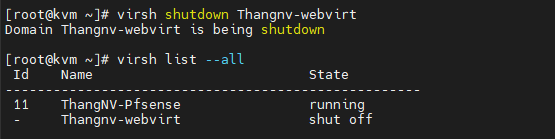
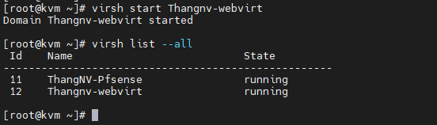
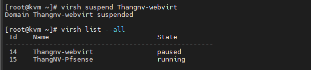

# Hướng dấn sử dụng các lệnh Command trong KVM
## I. Tìm hiểu về Virsh Command

`Virsh` là 1 phần của gói `libvirt` với bộ công cụ dòng lệnh để tương tác với `libvirt` có hỗ trợ quản lý KVM.`Virsh` cso nhiều tùy chọn:bật, tắt, sửa, xóa,...các VM cũng như xem thông tin các VM trên KVM.

### 1. Sử dụng virsh để quản lý các VM

- Hiển thị thông tin host KVM, sử dụng lênh: `virsh nodeinfo`
```
[root@kvm ~]# virsh nodeinfo
CPU model:           x86_64
CPU(s):              48
CPU frequency:       1202 MHz
CPU socket(s):       1
Core(s) per socket:  12
Thread(s) per core:  2
NUMA cell(s):        2
Memory size:         65706288 KiB
```
- Hiển thị thông tin VM, Sử dụng lệnh: `virsh dominfo Thangnv-webvirt`
```
[root@kvm ~]# virsh dominfo Thangnv-webvirt
Id:             9
Name:           Thangnv-webvirt
UUID:           f3cb00a6-c2fd-11eb-8e2c-b82a72d1bb23
OS Type:        hvm
State:          running
CPU(s):         5
CPU time:       3329.3s
Max memory:     3145728 KiB
Used memory:    3145728 KiB
Persistent:     yes
Autostart:      disable
Managed save:   no
Security model: selinux
Security DOI:   0
Security label: system_u:system_r:svirt_t:s0:c504,c648 (enforcing)
```

- Liệt kê tất cả các VM: `virsh list --all`
```
[root@kvm ~]# virsh list --all
 Id    Name                           State
----------------------------------------------------
 11    ThangNV-Pfsense                running
 -     Thangnv-webvirt                shut off

```
- Liệt kê các VM đang hoạt động : `virsh list`
```
[root@kvm ~]# virsh list
 Id    Name                           State
----------------------------------------------------
 11    ThangNV-Pfsense                running

```

- Hiển thị trạng thái của 1 VM: `virsh domstate [Tên VM]`

```
[root@kvm ~]# virsh domstate Thangnv-webvirt
running
```

- Tắt 1 VM : `virsh shutdown [tên VM]`
```
[root@kvm ~]# virsh shutdown Thangnv-webvirt
Domain Thangnv-webvirt is being shutdown
```


- Bật 1 VM : `virsh start [tên VM]`
```
[root@kvm ~]# virsh start Thangnv-webvirt
Domain Thangnv-webvirt started
```


- Tắt tất cả các VM đang hoạt động :
```
[root@kvm ~]# for i in `sudo virsh list | grep running | awk '{print $2}'`; do virsh shutdown $i;
> done
Domain ThangNV-Pfsense is being shutdown

Domain Thangnv-webvirt is being shutdown

[root@kvm ~]#

```

- Bật tất cả các VM:
```
virsh start $i 
```

- Tạm dừng 1 VM : `virsh suspend [tên VM]`
```
[root@kvm ~]# virsh suspend Thangnv-webvirt
Domain Thangnv-webvirt suspended
```


- Khởi động lại VM sau khi suspend: `virsh resume [tên VM]`
```
[root@kvm ~]# virsh resume Thangnv-webvirt
Domain Thangnv-webvirt resumed
```

- Liệt kê tất cả các image được gắn vào VM : `virsh domblklist [tên VM]`
```
[root@kvm ~]# virsh domblklist ThangNV-Pfsense
Target     Source
------------------------------------------------
vda        /var/lib/libvirt/images/ThangNV-Pfsense.qcow2
hda        /var/lib/libvirt/file-iso/CentOS-7-x86_64-Minimal-2003.iso

```

### 2. Sử dụng virsh quản lý card mạng của VM

- Liệt kê cổng của 1 VM: `virsh domiflist [tên VM] `
```
[root@kvm ~]# virsh domiflist Thangnv-webvirt
Interface  Type       Source     Model       MAC
-------------------------------------------------------
vnet0      network    natbr1     virtio      52:54:00:cf:ba:54

```

- Tắt 1 interface của VM : `virsh domif-setlink [tên VM] [interface] down `
```
[root@kvm ~]# virsh domif-setlink Thangnv-webvirt vnet0 down
Device updated successfully
```

- Bật 1 interface của VM : `virsh domif-setlink [tên VM] [interface] up `
```
[root@kvm ~]# virsh domif-setlink Thangnv-webvirt vnet0 up
Device updated successfully
```

- Kiểm tra trạng thái interface của VM: `virsh domif-getlink [tên VM] [interface]`
```
[root@kvm ~]# virsh domif-getlink Thangnv-webvirt vnet0
vnet0 up
[root@kvm ~]#
```

### 3. Gắn và tách 1 ổ đĩa khỏi VM
- Tách 1 disk khỏi VM :