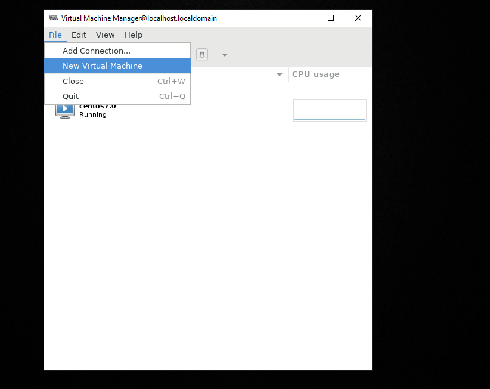
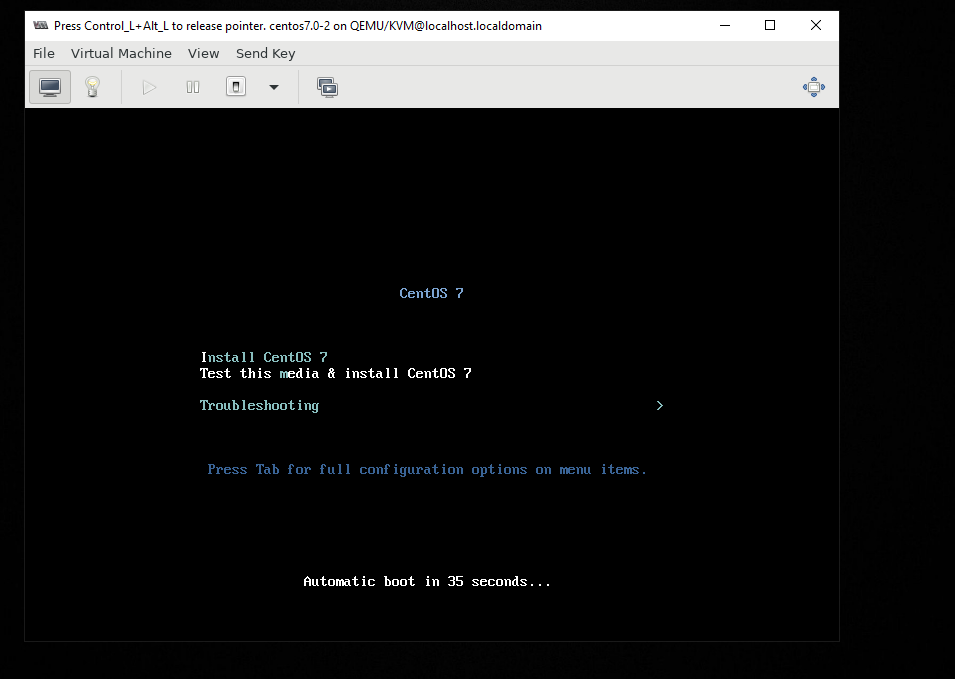
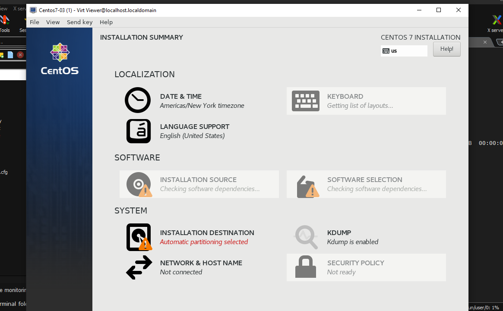

# Hướng dẫn cài đặt máy ảo KVM trên Centos 7
# I. Cài đặt KVM
<<<<<<< HEAD
## 1. Kiểm tra hỗ trợ ảo hóa
Để kiểm tra máy có hỗ trợ ảo hóa hay không?
```
# egrep -c "svm|vmx" /proc/cpuinfo
48
```
Nếu kết quả trả về 0 thì máy không hỗ trợ ảo hóa. Còn khác 0 tức là máy có hỗ trợ ảo hóa.


## 2. Cài đặt các gói cần thiết

```
yum -y install qemu-kvm libvirt virt-install bridge-utils virt-manager
```

Trong đó: 
  - qemu-kvm: Phần mềm phụ trợ cho KVM
  - libvirt: Quản lý qemu và kvm bằng libvirt
  - bridge-utils: Tiện ích cần thiết để tạo và quản lý các thiết bị bridge
  - virt-manager: Cung cấp giao diện quản lý máy ảo
  - virt-install: Cung cấp lệnh để cài đặt máy ảo

Sau khi cài đặt hoàn tất, kiểm tra các module KVM

```
lsmod | grep kvm
```


## 3. Bật libvirt và khởi động cùng hệ thống

```
systemctl start libvirt
systemctl enable libvirtd
```

reboot
```
init 6
```

# II. Cài đặt VM
## 2.1 Sử dụng công cụ Virt-manager để cài VM

Cấu hình cài đặt NAT từ dải mạng `192.168.27.0/24` đi ra internet.

- Truy cập ` vỉrt-manager`
```
virt-manager
```



- chọn đường dẫn đến file ios cài đặt VM


- Cài đặt các thông số cơ bản cho máy ảo, lựa chọn cầu hình : card mạng, ram, disk, CPU


- kiểm tra các thông số máy ảo rồi click chuột `Begin Installation`




Kết quả: 


- kiểm tra trạng thái máy ảo

```
virsh list --all
```


## 2.2 Cài đặt máy ảo với virt-install

- Cài `virt-install`
```
yum install virt-install

```
- Cài package `virt-viewer` để hiển thị quá trình tạo VM

```
yum install virt-viewer
```
- Cài mày ảo với các thông số 
  - disk: 20 GB
  - Ram : 3GB
  - CPU: 2
  - dải IP: 192.168.27.0/24 trên `virbr2`
```
virt-install \
--name=Centos7-03 \
--vcpus=2 \
--memory=3072 \
--cdrom=/var/lib/libvirt/file-iso/CentOS-7-x86_64-Minimal-2003.iso \
--disk=/var/lib/libvirt/images/centos7-03,size=20 \
--os-variant=rhel7 \
--network bridge=virbr2
```
khi bắ đầu ta sẽ thấy hiển thị sau đây


Các thông số cần chú ý:
```

  `-- Name`: Đặt tên cho máy ảo

  `-- Vcpus`: Số CPU tạo cho mấy ảo

  `--memory`: dung lượng RAM tạo cho máy ảo (đơn vị MiB)

  `--cdrom`:  chỉ ra đường dẫn đến file ISO. Nếu boot bằng cách khác dùng option

  `--location`: sau đó chỉ ra đường dẫn đến file (có thể là đường dẫn đến file trên internet)

  `--disk`: chỉ ra vị trí lưu disk của máy ảo.size chỉ ra dung lượng disk của máy ảo (đơn vị GiB)

  `--os-variant`: loại OS đang tạo. Option này có thể chỉ ra hoặc không nhưng nên sử dụng nó vì nó sẽ cải thiện hiệu năng của máy ảo sau này. Nếu bạn không biết HĐH bạn đang tạo thuộc loại nào bạn có thể tìm kiếm thông tin này bằng cách dùng lệnh `osinfo-query os`

  `--network`: loại mạng mà VM sử dụng.

```
Để tìm hiểu thêm về các `option` có thể sử dụng lệnh:
```
virt-install --help
```

- Sau khi thực hiện lệnh tiến hành cài đặt như bình thường




- kiểm tra vị trí lưu file disk của VM
```
[root@localhost images]# ls -alh /var/lib/libvirt/images/
total 52G
drwx--x--x.  2 root root 4.0K May 27 23:57 .
drwxr-xr-x. 11 root root 4.0K May 26 23:31 ..
-rw-------.  1 qemu qemu  21G May 28 00:04 centos7.0-2.qcow2
-rw-------.  1 qemu qemu  21G May 28 00:11 centos7-03
-rw-------.  1 qemu qemu  31G May 28 00:12 centos7.0.qcow2
[root@localhost images]#


```

