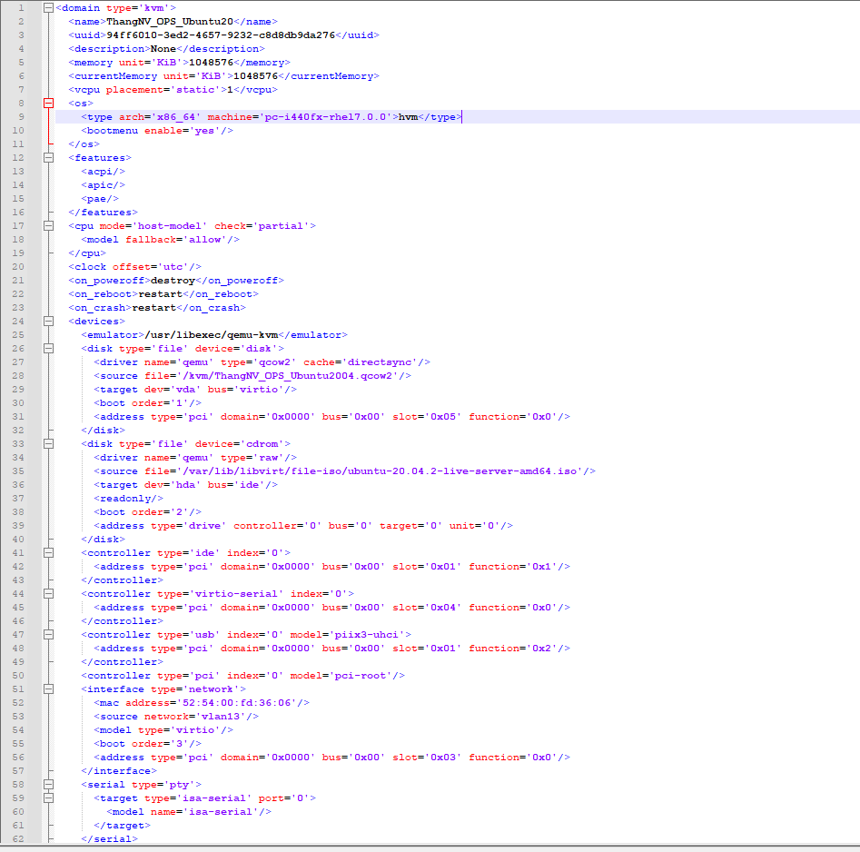
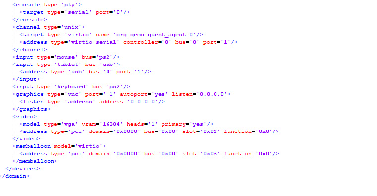
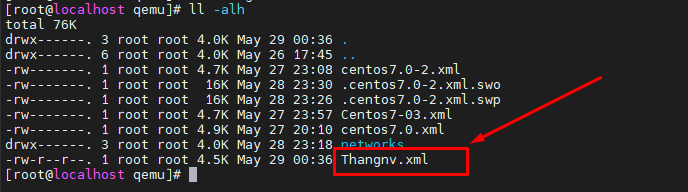

# Hướng dẫn cài đặt máy ảo KVM trên Centos 7
# I. Cài đặt KVM
<<<<<<< HEAD
## 1. Kiểm tra hỗ trợ ảo hóa
Để kiểm tra máy có hỗ trợ ảo hóa hay không?
```
# egrep -c "svm|vmx" /proc/cpuinfo
48
```
Nếu kết quả trả về 0 thì máy không hỗ trợ ảo hóa. Còn khác 0 tức là máy có hỗ trợ ảo hóa.


## 2. Cài đặt các gói cần thiết

```
yum -y install qemu-kvm libvirt virt-install bridge-utils virt-manager
yum install "@X Window System" xorg-x11-xauth xorg-x11-fonts-* xorg-x11-utils -y
```

Trong đó: 
  - qemu-kvm: Phần mềm phụ trợ cho KVM
  - libvirt: Quản lý qemu và kvm bằng libvirt
  - bridge-utils: Tiện ích cần thiết để tạo và quản lý các thiết bị bridge
  - virt-manager: Cung cấp giao diện quản lý máy ảo
  - virt-install: Cung cấp lệnh để cài đặt máy ảo

Sau khi cài đặt hoàn tất, kiểm tra các module KVM

```
lsmod | grep kvm
```


## 3. Bật libvirt và khởi động cùng hệ thống

```
systemctl start libvirtd
systemctl enable libvirtd
```

reboot
```
init 6
```

# II. Cài đặt VM
## 2.1 Sử dụng công cụ Virt-manager để cài VM

Cấu hình cài đặt NAT từ dải mạng `192.168.27.0/24` đi ra internet.

- Truy cập ` vỉrt-manager`
```
virt-manager
```


- chọn đường dẫn đến file ios cài đặt VM


- Cài đặt các thông số cơ bản cho máy ảo, lựa chọn cầu hình : card mạng, ram, disk, CPU


- kiểm tra các thông số máy ảo rồi click chuột `Begin Installation`


Kết quả: 


- kiểm tra trạng thái máy ảo

```
virsh list --all
```


## 2.2 Cài đặt máy ảo với virt-install

- Cài `virt-install`
```
yum install virt-install

```
- Cài package `virt-viewer` để hiển thị quá trình tạo VM

```
yum install virt-viewer
```
- Cài mày ảo với các thông số 
  - disk: 20 GB
  - Ram : 3GB
  - CPU: 2
  - dải IP: 192.168.27.0/24 trên `virbr2`
```
virt-install \
--name=Centos7-03 \
--vcpus=2 \
--memory=3072 \
--cdrom=/var/lib/libvirt/file-iso/CentOS-7-x86_64-Minimal-2003.iso \
--disk=/var/lib/libvirt/images/centos7-03,size=20 \
--os-variant=rhel7 \
--network bridge=virbr2
```
khi bắ đầu ta sẽ thấy hiển thị sau đây


Các thông số cần chú ý:
```

  `-- Name`: Đặt tên cho máy ảo

  `-- Vcpus`: Số CPU tạo cho mấy ảo

  `--memory`: dung lượng RAM tạo cho máy ảo (đơn vị MiB)

  `--cdrom`:  chỉ ra đường dẫn đến file ISO. Nếu boot bằng cách khác dùng option

  `--location`: sau đó chỉ ra đường dẫn đến file (có thể là đường dẫn đến file trên internet)

  `--disk`: chỉ ra vị trí lưu disk của máy ảo.size chỉ ra dung lượng disk của máy ảo (đơn vị GiB)

  `--os-variant`: loại OS đang tạo. Option này có thể chỉ ra hoặc không nhưng nên sử dụng nó vì nó sẽ cải thiện hiệu năng của máy ảo sau này. Nếu bạn không biết HĐH bạn đang tạo thuộc loại nào bạn có thể tìm kiếm thông tin này bằng cách dùng lệnh `osinfo-query os`

  `--network`: loại mạng mà VM sử dụng.

```
Để tìm hiểu thêm về các `option` có thể sử dụng lệnh:
```
virt-install --help
```

- Sau khi thực hiện lệnh tiến hành cài đặt như bình thường


- kiểm tra vị trí lưu file disk của VM
```
[root@localhost images]# ls -alh /var/lib/libvirt/images/
total 52G
drwx--x--x.  2 root root 4.0K May 27 23:57 .
drwxr-xr-x. 11 root root 4.0K May 26 23:31 ..
-rw-------.  1 qemu qemu  21G May 28 00:04 centos7.0-2.qcow2
-rw-------.  1 qemu qemu  21G May 28 00:11 centos7-03
-rw-------.  1 qemu qemu  31G May 28 00:12 centos7.0.qcow2
[root@localhost images]#


```

## 2.3 Tạo máy ảo với file XML

### Bước 1: Tạo file XML
- Để tạo 1 file XML khai báo đầy đủ thông tin của máy ảo có 2 phương pháp sử dụng là khai báo file xml theo đúng cấu trúc hoặc coppy 1 file xml hiện có và chính sửa các thông số cần thiết .

- Phương pháp sử dụng ở đây là coppy từ 1 file `XML` có sẵn và ` chỉnh sửa các tham số cần thiết:




### Bước 2: Tạo Disk

- khởi tạo ổ đĩa cho máy ảo có dung lượng 30 GB và định dạng là raw
```
[root@localhost images]# qemu-img create -f raw /var/lib/libvirt/images/Thangnv.img 30G
Formatting '/var/lib/libvirt/images/Thangnv.img', fmt=raw size=32212254720

```


### Bước 3: Tạo uuid

- Tạo mã uuid, cài đặt gói uuid và generate đoạn mã uuid
```
yum install uuid -y

uuid
```


### Bước 4: chỉnh sửa các tham số cần thiết
- Các thông tin và tham số cần chỉnh sửa bao gồm:
```
- Thông tin về: ram , CPU, Disk
- Đường dẫn đến Disk: /var/lib/libvirt/images/Thangnv.img
- Đường dẫn CDROM để boot máy ảo: /var/lib/libvirt/file-iso/CentOS-7-x86_64-Minimal-2003.iso
- Card mạng: NAT IP qua natbr1 để lấy dải IP_Private: 192.168.27.0/24
```


- Truy cập thư mục `cd /etc/libvirt/qemu/` tạo `file xml` có nội dung

```
<domain type='kvm'>
  <name>Thangnv-webvirt</name>
  <uuid>e896b3ac-c2fc-11eb-9fb9-b82a72d1bb23</uuid>
  <description>Web virtcloud</description>
  <memory unit='KiB'>3145728</memory>
  <currentMemory unit='KiB'>3145728</currentMemory>
  <vcpu placement='static'>5</vcpu>
  <os>
    <type arch='x86_64' machine='pc-i440fx-rhel7.0.0'>hvm</type>
    <bootmenu enable='yes'/>
  </os>
  <features>
    <acpi/>
    <apic/>
    <pae/>
  </features>
  <cpu mode='host-model' check='partial'>
    <model fallback='allow'/>
  </cpu>
  <clock offset='utc'/>
  <on_poweroff>destroy</on_poweroff>
  <on_reboot>restart</on_reboot>
  <on_crash>restart</on_crash>
  <devices>
    <emulator>/usr/libexec/qemu-kvm</emulator>
    <disk type='file' device='disk'>
      <driver name='qemu' type='raw' cache='directsync'/>
      <source file='/var/lib/libvirt/images/Thangnv-webvirt.img'/>
      <target dev='vda' bus='virtio'/>
      <boot order='2'/>
      <address type='pci' domain='0x0000' bus='0x00' slot='0x05' function='0x0'/>
    </disk>
    <disk type='file' device='cdrom'>
      <driver name='qemu' type='raw'/>
      <source file='/var/lib/libvirt/file-iso/CentOS-7-x86_64-Minimal-2003.iso'/>
      <target dev='hda' bus='ide'/>
      <readonly/>
      <boot order='1'/>
      <address type='drive' controller='0' bus='0' target='0' unit='0'/>
    </disk>
    <controller type='ide' index='0'>
      <address type='pci' domain='0x0000' bus='0x00' slot='0x01' function='0x1'/>
    </controller>
    <controller type='virtio-serial' index='0'>
      <address type='pci' domain='0x0000' bus='0x00' slot='0x04' function='0x0'/>
    </controller>
    <controller type='usb' index='0' model='piix3-uhci'>
      <address type='pci' domain='0x0000' bus='0x00' slot='0x01' function='0x2'/>
    </controller>
    <controller type='pci' index='0' model='pci-root'/>
    <interface type='bridge'>
      <mac address='52:54:00:e7:ef:f2'/>
      <source bridge='br1'/>
      <model type='virtio'/>
      <address type='pci' domain='0x0000' bus='0x00' slot='0x03' function='0x0'/>
    </interface>
    <interface type='network'>
      <mac address='52:54:00:48:c6:6b'/>
      <source network='natbr1'/>
      <model type='virtio'/>
      <address type='pci' domain='0x0000' bus='0x00' slot='0x04' function='0x0'/>
    </interface>
    <serial type='pty'>
      <target type='isa-serial' port='0'>
        <model name='isa-serial'/>
      </target>
    </serial>
    <console type='pty'>
      <target type='serial' port='0'/>
    </console>
    <channel type='unix'>
      <target type='virtio' name='org.qemu.guest_agent.0'/>
      <address type='virtio-serial' controller='0' bus='0' port='1'/>
    </channel>
    <input type='mouse' bus='ps2'/>
    <input type='tablet' bus='usb'>
      <address type='usb' bus='0' port='1'/>
    </input>
    <input type='keyboard' bus='ps2'/>
    <graphics type='vnc' port='-1' autoport='yes' listen='0.0.0.0'>
      <listen type='address' address='0.0.0.0'/>
    </graphics>
    <video>
      <model type='vga' vram='16384' heads='1' primary='yes'/>
      <address type='pci' domain='0x0000' bus='0x00' slot='0x02' function='0x0'/>
    </video>
    <memballoon model='virtio'>
      <address type='pci' domain='0x0000' bus='0x00' slot='0x06' function='0x0'/>
    </memballoon>
  </devices>
</domain>

```

### Bước 5: Khởi tạo máy ảo

- Coppy file xml đã chỉnh sử lên máy chủ KVM



- Sử dụng lệnh virsh để tạo máy ảo từ file xml vừa chỉnh sửa -> Một máy ảo sẽ được tạo ra tiến hành cài đặt như bình thường.

```
[root@localhost qemu]# virsh create Thangnv.xml
Domain Thangnv created from Thangnv.xml
```


