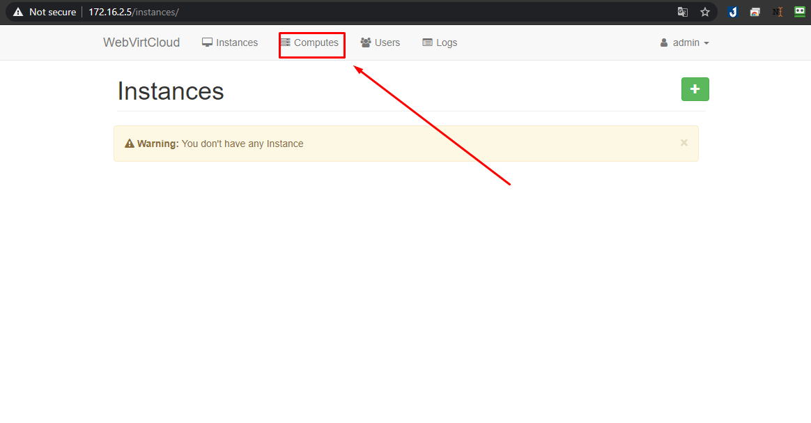
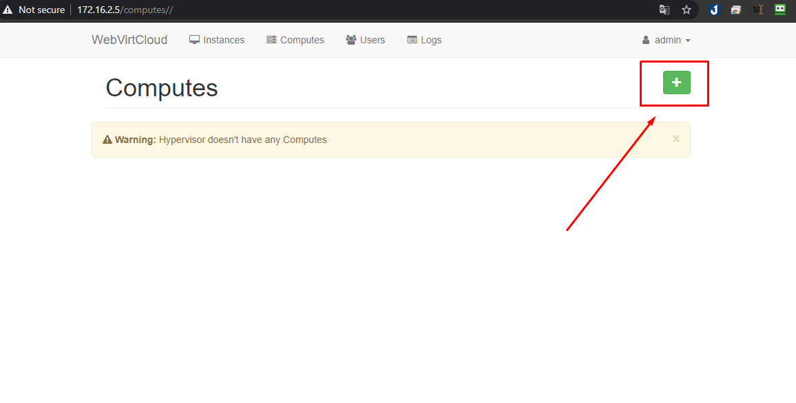
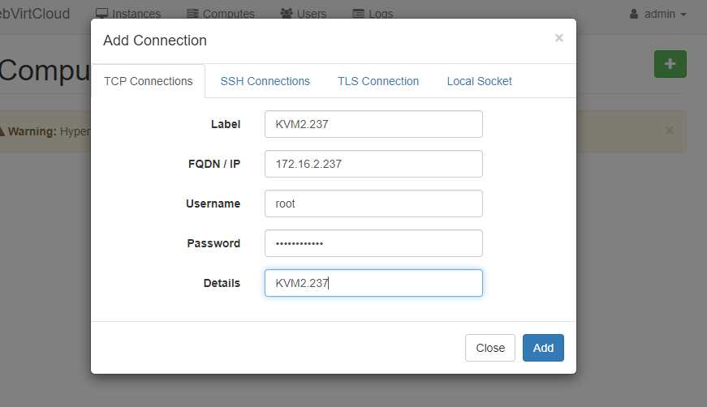

# Hướng dẫn cài đặt webvirtcloud quản lý hạ tầng KVM
## Phần I. Cài đặt
### Bước 1: Cài đặt KVM
- Hướng dẫn cài đặt KVM và tạo VM trên CentOS 7 [tại đây](https://github.com/thang290298/work-Document/blob/master/KVM/Document/LAB/09-Creat-KVM-Centos7.md)

Để có thể kết nối KVM với WebvirtCloud cần thực hiện một sô yêu cầu trên `KVM`

- Chỉnh sửa file cấu hình `libvirt`:
```
vi /etc/libvirt/libvirtd.conf
```
```
//Nội dung

listen_tls = 0
listen_tcp = 1
tcp_port = "16509"
listen_addr = "0.0.0.0"
auth_tcp = "none"  

```
- Chỉnh sửa file `/etc/sysconfig/libvirtd ` : bỏ dấu # ở dòng sau :`LIBVIRTD_ARGS="--listen"`

- Cho phép `port 16509` của `libvirt` và dải `port 5900-5999` của VNC đi qua `firewalld`:
```
firewall-cmd --permanent --add-port=16509/tcp
firewall-cmd --permanent --add-port=5900-5999/tcp
firewall-cmd --reload

```
- Restart lại dịch vụ `libvirt` :
```
systemctl restart libvirtd
```

### Bước 2: Cài đặt webvirtcloud
#### 2.1 Cài đặt các gói packages cần thiết

```
yum install epel-release -y
yum -y install python-virtualenv python-devel libvirt-devel glibc gcc nginx supervisor python-lxml git python-libguestfs
```

#### 2.2 Tạo thư mục và clone source code từ trang chủ về

```
cd /srv
git clone https://github.com/retspen/webvirtcloud && cd webvirtcloud
git checkout 1e2fbc8
cp webvirtcloud/settings.py.template webvirtcloud/settings.py

```

#### 2.3 Thay thế secret key

```
[root@webvirtvloud webvirtcloud]# pwd
/srv/webvirtcloud
```

Thay đổi chuỗi secret key trong file `settings.py`bằng một đoạn string ngẫu nhiên mà chỉ mỗi bạn sở hữu

```
vim webvirtcloud/settings.py
```
Như sau:
```
SECRET_KEY = '0962012918tT#'
```
#### 2.4 Cài đặt webvirtcloud

```
[root@webvirtvloud webvirtcloud]# pwd
/srv/webvirtcloud
```
```
virtualenv venv
source venv/bin/activate
venv/bin/pip install -r conf/requirements.txt
cp conf/nginx/webvirtcloud.conf /etc/nginx/conf.d/
venv/bin/python manage.py migrate
```

#### 2.5 Cấu hình supervisor
- Thêm cấu hình vào cuối file `/etc/supervisord.conf`

```
cp /etc/supervisord.conf /etc/supervisord.conf.bk
vim /etc/supervisord.conf
```
Nội dung

```
[program:webvirtcloud]
command=/srv/webvirtcloud/venv/bin/gunicorn webvirtcloud.wsgi:application -c /srv/webvirtcloud/gunicorn.conf.py
directory=/srv/webvirtcloud
user=nginx
autostart=true
autorestart=true
redirect_stderr=true

[program:novncd]
command=/srv/webvirtcloud/venv/bin/python /srv/webvirtcloud/console/novncd
directory=/srv/webvirtcloud
user=nginx
autostart=true
autorestart=true
redirect_stderr=true
```
#### 2.6 Cấu hình nginx

Comment lại block server trong file `/etc/nginx/nginx.conf` như sau:

```
#    server {
#        listen       443 ssl http2 default_server;
#        listen       [::]:443 ssl http2 default_server;
#        server_name  _;
#        root         /usr/share/nginx/html;
#
#        ssl_certificate "/etc/pki/nginx/server.crt";
#        ssl_certificate_key "/etc/pki/nginx/private/server.key";
#        ssl_session_cache shared:SSL:1m;
#        ssl_session_timeout  10m;
#        ssl_ciphers HIGH:!aNULL:!MD5;
#        ssl_prefer_server_ciphers on;
#
#        # Load configuration files for the default server block.
#        include /etc/nginx/default.d/*.conf;
#
#        location / {
#        }
#
#        error_page 404 /404.html;
#        location = /404.html {
#        }
#
#        error_page 500 502 503 504 /50x.html;
#        location = /50x.html {
#        }
#    }

```
Sau đó chỉnh sửa file `/etc/nginx/conf.d/webvirtcloud.conf`:

```
upstream gunicorn_server {
    #server unix:/srv/webvirtcloud/venv/wvcloud.socket fail_timeout=0;
    server 127.0.0.1:8000 fail_timeout=0;
}
server {
    listen 80;

    server_name servername.domain.com;
    access_log /var/log/nginx/webvirtcloud-access_log; 

    location /static/ {
        root /srv/webvirtcloud;
        expires max;
    }

    location / {
        proxy_pass http://gunicorn_server;
        proxy_set_header X-Real-IP $remote_addr;
        proxy_set_header X-Forwarded-for $proxy_add_x_forwarded_for;
        proxy_set_header Host $host:$server_port;
        proxy_set_header X-Forwarded-Proto $remote_addr;
        proxy_connect_timeout 600;
        proxy_read_timeout 600;
        proxy_send_timeout 600;
        client_max_body_size 1024M;
    }
}
```
2.7 Phần quyền cho các thư mục

- Phân quyền cho user nginx có thể đọc được file trong thư mục chứa code

```
chown -R nginx:nginx /srv/webvirtcloud
```

- Phần quyền cho selinux
```
yum install policycoreutils-python -y
setenforce 0
semanage fcontext -a -t httpd_sys_content_t "/srv/webvirtcloud(/.*)"
```
#### 2.8 Cấu hình firewalld

```
firewall-cmd --permanent --add-port=80/tcp
firewall-cmd --permanent --add-port=6080/tcp
firewall-cmd --reload
```

#### 2.9 Restart và Enable services

```
systemctl restart nginx && systemctl restart supervisord
systemctl enable nginx && systemctl enable supervisord
```

#### 2.10 Truy cập WebvirtCloud on browser

- Truy cập đường dẫn: `http://172.16.2.5`

Thông tin tài khoản mặc định
```
User: admin
Password: admin

```
### Bước 3: Add node KVM

Tiến hành đăng nhập, sau đó add node


- click `Compute`



- Click dấu ` + ` để add node `KVM`


- Điền thông tin node KVM cần add


- Kết quả

