# Tìm hiểu file XML trong KVM
## Mục lỤC
[I. Tổng quan về XML]
[II. Các thành phần trong file domain XML]
[1. Metadata]
[2. Operating system booting]
[3. BIOS Bootloader]
[4. Direct kernel boot]
[5. CPU Allocation]
[6. vcpu]
[7. Memory Allocation]
[8. memory]
[9. Events configuration]
[10. Hypervisor features]
[11. Time keeping]
[12. Devices]
[12.1. Disk]
[12.2. Controller]
[13. Network interfaces]
[14. Input devices]
[15. Graphical framebuffers]
[16. Video devices]
[17. Guest interface]
[18. Sound devices]
[19. Memory balloon device]
[III. Các thành phần trong file network XML]
[1. General Metadata]
[2. Connectivity]
[3.Quality of service]
[4. Static Routes]
[5. Addressing]
[IV. Tài liệu tham khảo]
## I. Tổng quan về XML
XML (viết tắt từ tiếng Anh: eXtensible Markup Language, tức “Ngôn ngữ đánh dấu mở rộng”) là ngôn ngữ đánh dấu với mục đích chung do W3C đề nghị, để tạo ra các ngôn ngữ đánh dấu khác. Đây là một tập con đơn giản của SGML, có khả năng mô tả nhiều loại dữ liệu khác nhau. Mục đích chính của XML là đơn giản hóa việc chia sẻ dữ liệu giữa các hệ thống khác nhau, đặc biệt là các hệ thống được kết nối với Internet.

VM trong KVM có hai thành phần chính đó là VM’s definition được lưu dưới dạng file XML mặc định ở thư mục /etc/libvirt/qemu và VM’s storage lưu dưới dạng file image.

File domain XML chứa những thông tin về thành phần của máy ảo (số CPU, RAM, các thiết lập của I/O devices…)

Ngoài domain XML, KVM cũng có các file XML khác để lưu các thông tin liên quan tới network, storage…

 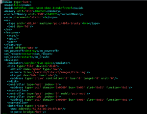

 ## II. Các thành phần trong file domain XML
 Thẻ không thể thiếu trong file domain xml là domain. Nó có 2 thành phần chính: type cho biết hypervisor đang sử dụng, id là mã nhận dạng của máy ảo.

 ### 1. Metadata

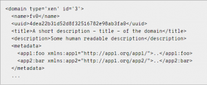

- `name`: Tên máy ảo, chỉ bao gồm kí tự chữ và số và không được trùng với những máy ảo đang chạy.
- `uuid`: Mã nhận dạng quốc tế duy nhất cho máy ảo. Format theo RFC 4122. Nếu thiếu trường uuid khi khởi tạo, mã này sẽ được tự động generate.
- `title`: Tiêu đề của máy ảo.
- `description`: Đoạn mô tả của máy ảo, nó sẽ không được libvirt sửa dụng.
- `metadata`: Chứa những thông tin về file xml.

### 2. Operating system booting

Có nhiều các để boot máy ảo và mỗi cách lại có những lợi ích và hạn chế riêng. Bài viết này sẽ chỉ đưa ra 2 ví dụ đó là boot từ BIOS và kernel

### 3. BIOS Bootloader
Boot thông qua BIOS được hỗ trợ bởi những hypervisors full virtualization. Người dùng sẽ phải thiết lập thứ tự ưu tiên các thiết bị boot.

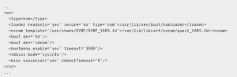

- `type:` Chỉ ra loại OS được boot để tạo thành VM. hvm cho biết OS cần chạy trên `bare metal`, yêu cầu full virtualization. arch chỉ ra loại kiến trúc CPU dùng để ảo hóa, machine chỉ la loại máy sử dụng.

-` boot :` dev chỉ ra thiết bị dùng để khởi động. Nó có thể là fd, hd, cdrom hoặc network. Nếu có nhiều thiết bị được khai báo, nó sẽ được sắp xếp làm thứ tự ưu tiên.

-` bootmenu :` Chỉ ra có cho khởi động boot menu hay không. Tùy chọn enable có giá trị yes hoặc no. timeout là thời gian đợi trước khi sử dụng chế độ mặc định.

### 4. Direct kernel boot

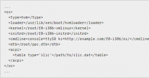

- `loader :` readonly có giá trị yes hoặc no chỉ ra file image writable hay 

readonly. type có giá trị rom hoặc pflash chỉ ra nơi guest memory được kết nối.

- `kernel :` đường dẫn tới kernel image trên hệ điều hành máy chủ

- `initrd:` đường dẫn tới ramdisk image trên hđh máy chủ

cmdline: xác định giao diện điều khiển thay thế

### 5. CPU Allocation

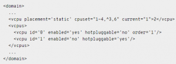

### 6. vcpu

Trạng thái của từng cpu cụ thể

### 7. Memory Allocation

 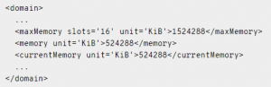

### 8. memory

Dung lượng RAM tối đa ở thời điểm khởi động.

- `unit:` đơn vị, mặc định là KiB (kibibytes = 1024 bytes), có thể sử dụng b (bytes), KB (Kilobytes = 1000 bytes), MB (Megabytes = 1000000 bytes), M hoặc MiB (Mebibytes = 1,048,576 bytes), GB (gigabytes = 1,000,000,000 bytes), G hoặc GiB (gibibytes = 1,073,741,824 bytes), TB (terabytes = 1,000,000,000,000 bytes), T hoặc TiB (tebibytes = 1,099,511,627,776 bytes)

- `maxMemory:` Dung lượng RAM tối đa có thể sử dụng

- `urrentMemory:` Dung lượng RAM thực tế đang được sử dụng

### 9. Events configuration

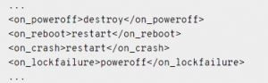

`on_poweroff:` Hành động được thực hiện khi người dùng yêu cầu tắt máy

- `on_reboot:` Hành động được thực hiện khi người dùng yêu cầu reset máy

- `on_crash:` Hành động được thực hiện khi có sự cố

Những hành động được phép thực thi:

- `destroy:` Chấm dứt và giải phóng tài nguyên

- `restart:` Chấm dứt rồi khởi động lại giữ nguyên cấu hình

- `preserve:` Chấm dứt nhưng dữ liệu vẫn được lưu lại

- `rename-restart:` Khởi động lại với tên mớidestroy và restart được hỗ trợ trong cả `on_poweroff` và `on_reboot`. preserve dùng trong `on_reboot`, `rename-restart` dùng trong `on_poweroff`

`on_crash` hỗ trợ 2 hành động:

- `coredump-destroy:` domain bị lỗi sẽ được dump trước khi bị chấm dứt và giải phóng tài nguyên

- `coredump-restart:` domain bị lỗi sẽ được dump trước khi được khởi động lại với cấu hình cũ

### 10. Hypervisor features

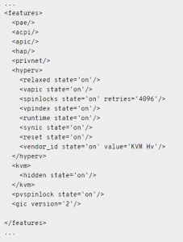

- `pae:` Chế độ mở rộng địa chỉ vật lí cho phép sử dụng 32 bit để lưu trữ tới hơn 4GB bộ nhớ.

- `acpi:` Được sử dụng để quản lí nguồn điện

- `apic:` Sử dụng cho quản lí IRQ

- `hap:` Bật/tắt chết độ phần cứng hỗ trợ, mặc định nó sẽ bật.

### 11. Time keeping
Clock

`offset :` giá trị `utc`, `localtime`, `timezone`và `variable`

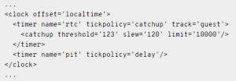

### 12. Devices

emulator
* Đường dẫn tới thiết bị mô phỏng nhị phân. Trong KVM, đó là /usr/bin/kvm

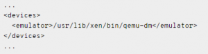

Hard drives, floppy disks, CDROMs

#### 12.1. Disk

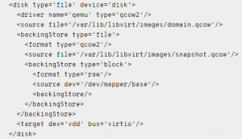

disk: Mô tả ổ đĩa, bao gồm các giá trị:

- `type:` kiểu ổ đĩa, có thể chọn “file”, “block”, “dir”, “network” hoặc “volume"

- `device:` Cách ổ đĩa tiếp xúc với hệ điều hành. Các giá trị có thể chọn là “floppy”, “disk”, “cdrom”, “lun”. Giá trị mặc định là “disk”.

- `snapshot:` Chọn chế độ mặc định của ổ đĩa khi snapshot. Các giá trị ở đây là “internal”, “external” và “no”

`source :`

- `file:` Đường dẫn tới ổ đĩa

- `dir:` Đường dẫn tới thư mục chứa ổ đĩa

`target:`
- `dev:` tên loại ổ đĩa, ví dụ: vda, hda…

- `bus:` xác định loại thiết bị ổ đĩa để mô phỏng, các giá trị: “ide”, “scsi”, “virtio”, “xen”, “usb”, “sata”, or “sd” “sd”

`driver:`
- `name:` tên trình điều khiển hỗ trợ, ở đây mặc định sẽ là “qemu”

- `type:` “dự bị” cho “name” ở trên, các giá trị có thể chọn : “raw”, “bochs”, “qcow2”, và “qed”

`address:`
- `type:` Loại controller, có thể chọn “pci” hoặc “drive”, đối với “drvie”, các giá trị 

“controller”, “bus”, “target”, và “unit” sẽ được mặc định thêm vào và có giá trị là 0

#### 2. Controller

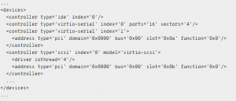

Tùy thuộc vào cấu trúc của máy ảo mà nó có thể có các thiết bị ảo đi kèm, mỗi cái lại đi theo một bộ điều khiển. Thường thì libvirt sẽ tự động chỉ ra mà không cần khai báo qua file xml.

Mỗi bộ điều khiển có một tham số bắt buộc là type và index, các giá trị có thể chọn của type là: ‘ide’, ‘fdc’, ‘scsi’, ‘sata’, ‘usb’, ‘ccid’, ‘virtio-serial’ hoặc ‘pci’. Trong khi đó index sẽ chỉ ra thứ tự ưu tiên.

### 13. Network interfaces

Có một vài kiểu set up network ví dụ như Virtual network (type = network), Bridge to LAN (type = bridge), Userspace SLIRP stack (type=user). Ở đây tôi sẽ nói về Bridge to LAN.

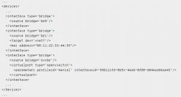

- `source:` tham số bắt buộc là “bridge”: tên bridge

- `mac:` tham số bắt buộc là “address”: địa chỉ mac

- `mode:` tham số bắt buộc là “type”, các giá trị thường được sử dụng trong KVM: “ne2k_isa, i82551, i82557b, i82559er, ne2k_pci, pcnet, rtl8139, e1000, virtio”
 
     Cài đặt tĩnh

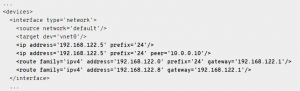

### 14. Input devices

Chỉ có 1 tham số bắt buộc đó là type, các giá trị có thể chọn là ‘mouse’, ‘tablet’, ‘keyboard’ hoặc ‘passthrough’. Tham số bus để xác định chính xác thiết bị, các giá trị có thể chọn là “xen” (paravirtualized), “ps2”, “usb” và “virtio”.

### 15. Graphical framebuffers

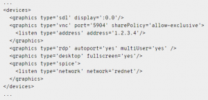

- `graphic:` Thuộc tính bắc buộc là type, các giá trị có thể chọn : “sdl”, “vnc”, “spice”, “rdp” và “desktop”. Đối với mỗi loại sẽ có thêm những tham số được thêm vào.

### 16. Video devices

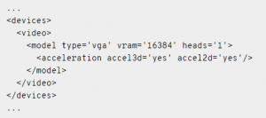

- `model:` Tham số bắt buộc là “type”, các giá trị có thể lựa chọn là “vga”, “cirrus”, “vmvga”, “xen”, “vbox”, “qxl”, “virtio” và “gop”, tùy thuộc vào hypervisor.

- `heads:` số lượng màn hình
ram và vram chỉ ra kích thước của primary và secondary bar

### 17. Guest interface
`serial port:`

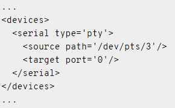

`console:`

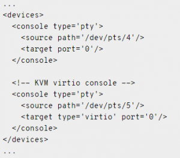
Nếu không có target type được chọn , mặc định trong KVM sẽ sử dụng serial.

### 18. Sound devices

- `sound:` tham số bắt buộc là model, các giá trị có thể chọn : ‘es1370’, ‘sb16’, ‘ac97’, ‘ich6’ và ‘usb’

### 19. Memory balloon device
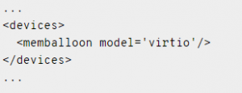

Được thêm tự động, mặc định với KVM, model sẽ là virtio

Trên đây chỉ là một số thành phần chính trong file domain xml của KVM, tham khảo thêm [Domain XML format](https://libvirt.org/formatdomain.html#elementsDevices).

## III. Các thành phần trong file network XML

Giống như domain, mỗi một virtual network trong KVM sẽ được định nghĩa bằng 1 file có định dạng xml, mặc định lưu tại `/var/lib/libvirt/networks`

File` virtual network` mặc định của KVM là `default.xml`, trong file này chứa các thông tin giúp KVM tạo mạng ảo với chế độ mặc định là `NAT`

Ví dụ về file network xml:

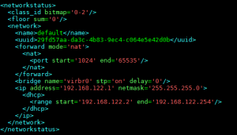

Các thành phần chính trong file network xml

Thẻ không thể thiếu trong file network xml là`network`

### 1. General Metadata

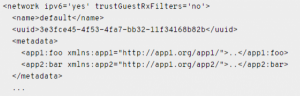

- `name:` Tên của virtual network
- `uuid:` uuid của virtual network

### 2. Connectivity
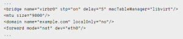

- `bridge:` Bao gồm các tham số

- `name:` tên của bridge

- `stp:` tùy chọn bật hoặc tắt Spanning Tree Protocol

- `delay:` thiết lập thời gian delay theo giây, mặc định là 0

- `macTableManager:` Thiết lập quản lí bảng địa chỉ MAC, mặc định sẽ là “kernel”

- `mtu:` tham số bắt buộc là size : khai báo kích cỡ của Maximum Transmission Unit (MTU)

- `domain:` Là thẻ tùy chọn, chỉ được sử dụng với những network có thẻ <foward>.

- `name:` khai báo DNS domain của DHCP server

- `forward:` Thẻ forward cho biết mạng ảo sẽ được kết nối với mạng vật lí, nếu không có thẻ này, virtual network sẽ ở trạng thái isolated. Tham số mode cho biết phương pháp forward dữ liệu ra bên ngoài, mặc định sẽ là nat.

Các phương thức:

- `nat:` Các máy ảo sẽ kết nối ra ngoài internet theo phương thức NAT. Thẻ con address sẽ xác định range của địa chỉ cấp cho các máy ảo, bao gồm start và end. Ngoài address, người dùng cũng có thể set port range.

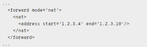

- `route:` Dữ liệu sẽ được forward tới card vật lí nhưng không thông qua giao thức NAT. Các rules của firewall sẽ được thiết lập để hạn chế việc truyền dữ liệu.

- `open:` giống như route nhưng sẽ không có rules nào của firewall được thiết lập.

- `bridge:` sử dụng network bridge, có thể là linux bridge hoặc Open vSwitch.

### 3.Quality of service

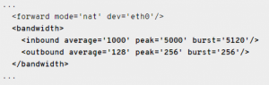

- `bandwidth:` Thiết lập băng thông

- `average:` Tốc độ bit trung bình (kilobytes/giây)

- `peak:` Tham số tùy chọn, xác định tốc độ tối đa mà bridge có thể gửi dữ liệu (kilobytes/giây)

### 4. Static Routes

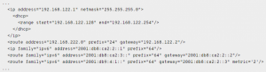

- `route:` Khai báo một route tĩnh

- `family:` Loại phiên bản IP: IPv4 hoặc IPv6

- `address:` Địa chỉ IP đích

- `prefix:` Prefix của mạng đích

- `gateway:` Khai báo gateway dẫn tới đích

- `metric:` Đặt metric cho đường mạng, số càng nhỏ thì độ ưu tiên càng cao

### 5. Addressing

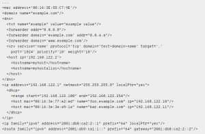

- `mac:` Địa chỉ mac của bridge, tham số bắt buộc là address

- `dns:` DNS server của virtual network. Các thẻ thành phần phụ của thẻ <dns> bao gồm fowarder, txt, host, srv.

- Thẻ forwarder khai báo dns server, có thể khai báo bằng địa chỉ ip (address) hoặc tên domain.
- Thẻ txt khai báo bản ghi DNS TXT, nó có 2 giá trị, 1 là name sẽ được truy vấn qua dns, 2 là value được trả lại khi truy vấn thành công.

- Thẻ host sẽ chỉ định những máy nào được sử dụng dịch vụ dns, tham số của nó là ip, nó cũng có thể sử dụng thẻ phụ hostname để khai báo bằng tên máy. Thẻ server khai báo bản ghi DNS SRV có 2 tham số bắt buộc là name và protocol.

- ip: Thiết lập địa chỉ ip. Bao gồm các thẻ nhỏ: dhcp (bao gồm thẻ range và host) và tftp

## 4. Tài liệu tham khảo

https://ductam.info/tim-hieu-file-xml-trong-kvm/

