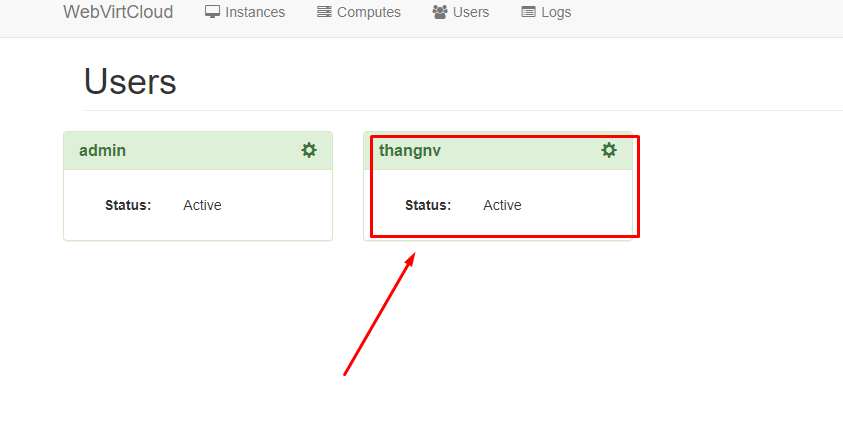

# Hướng dẫn sử dụng webvirtcloud
## I. Tạo Account và change pass
### 1. Tạo mới account 

- Click vào dấu `+`:


- Điền thông tịn `account` và `password` sau đó click `Create` để tạo mới tài khoản 


- Kết quả: 


### 2. Thay đổi mật khẩu và Quota cho user

- Đối với tài khoản admin sau khi cài đặt sẽ có mật khẩu defaul là `admin` nên cần phải thay đổi để nâng cao tính bảo mật, ngoài ra có thể thay đổi `quota` đối với mỗi `user` để cấp phát tài nguyên được phép sử dụng. Để `edit user chọn vào biểu tượng bánh răng cưa:


  
Trong đó: 

```
 - Name: Tên tài khoản user
 - Password: Nhập mật khẩu mới nếu cần thay đổi
 - Is staff: quyền user thường
 - Is superuser : quyền user admin
 - Can clone instances: cho phép coppy các phiên bản VM
 - Max instances: số VM tạo tối đa
 - Max cpus: Số CPU cấp tối đa
 - Max memory (MB): Số ram có thể sử dụng
 - Max disk size (GB): Tổng dung lượng disk có thể sử dụng
```

### 2. Tạo Storage Pool
Tiến hành tạo Pool đẻ lưu các `Volume` và `ISO` cho các VM
- Vào `Computers` và chọn `Note Computes` muốn tạo `Pool`


- Chọn `Storage` sau đó Click dấu `+`:


- Điền thông tin và tạo `Pool`:


- Tạo đường dẫn lưu `ISO`


- Sau khi tạo xong `Pool`


### 3. Tạo Network

- Chọn `Networks` click `+` và điền thông tin dải mạng :


### 4. Add VM cho user thường

Đối với tài khoản `admin` và các tài khoản `superuser` có quyền gán VM thuộc tất cả các node Computer vào user người dùng bất kỳ. User đó sẽ có quyền quản lý và sử dụng.

- Để gán `VM` cho `User` ta chọn : User rồi vào user cần add VM


- Chọn `+` và tiến hành add `VM`:


- Phân quyền user đối với VM:


### 3. Tạo VM
Bước 1: Tạo 1 storage để chạy VM. 
- Chúng ta chọn `Computer` 


- Tại giao diện `kvm124` ta chọn phần `storages` sau đó chọn phân vùng tạo VM.


- Click chọn biểu tượng `+ `để thêm Volume: 


- Tiến hành đặt tên, chọn định dạng và chọn dung lượng cho VM. Sau khi hoàn thành bấm chọn `Create` để tạo Storage cho VM.


- Thông báo sau khi hoàn thành: 


Bước 2: Tạo VM

- Vào ` Instances` tích vào dấu `+` để tạo mới VM


- Chọn ` Custom ` hoặc những mấu có sắm


- Tiến hành đặt ` teen`, chọn cấu hình `CPU` và `Ram`.


- Tại phần HDD, ta chọn volume đã tạo ở trên để tạo VM. Ở đây chọn vào `Storage` đã tạo trước đó ở bước 1:


- Chọn Network. Rồi click `Create`


Bước 3: Sau khi thành công sẽ hiển thị giao diện bên dưới. Chọn `Setting`


- Tiếp theo tiến hành chọn `Disk` và file `ISO` để tiến hành `Mount` và cài đặt `OS`


- Sang mục `Boot`. Tại mục `Boot Order`, ta sẽ chọn 2 phần `vda`, `hda`rồi click `Apply`


