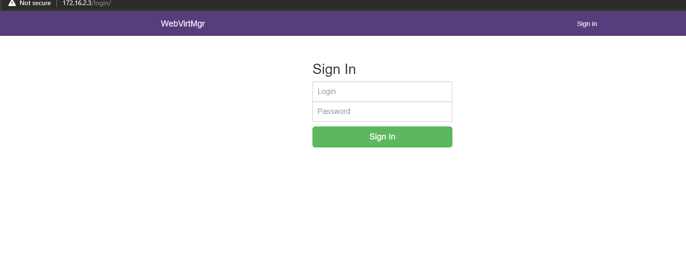
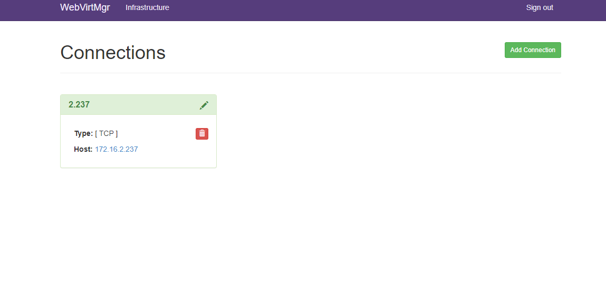

# Hướng dẫn cài đặt Webvirtmgr trên CentOS 7

## Tổng quan

- Webvirtmgr là một trong những công cụ quản lý máy ảo KVM tương tự webvirtcloud. Nó có chức năng tương tự gần giống với `virt-manager` khi có thể kết nối và quản lý tập trung VM trên nhiều host KVM khác nhau. Ưu điểm khác biệt giữa `virt-manager` và `Webvirtmgr` là `Webvirtmgr` có thể sử dụng tại bất kỳ đâu có kết nối internet thông qua các trình duyệt web, còn đối với `virt-manager` chỉ có thể sử dụng trên các thiết bị đã cài đặt .

###  Chuẩn bị

- Một máy cài đặt hệ điều hành CentOS 7 có cấu hình tối thiểu 1 CPU, 1 GB RAM và có 1 card mạng.

- Một máy CentOS 7 đã cài đặt KVM để kiểm tra lại webvirtmgr đã hoạt động.

## I. Cài đặt Webvirtmgr trên CentOS7

### Bước 1: Cài một số gói cần thiết

```
yum install epel-release

yum -y install git python-pip libvirt-python libxml2-python python-websockify supervisor nginx cyrus-sasl-md5
yum -y install gcc python-devel
pip install --upgrade pip
wget https://bootstrap.pypa.io/pip/2.7/get-pip.py
python get-pip.py
pip install numpy

```

### Bước 2: Clone Webvirtmgr từ GitHub và cài đặt

```
git clone git://github.com/retspen/webvirtmgr.git
cd webvirtmgr
pip install -r requirements.txt

```
- Thiết lập môi trường Django và tạo ra một tài khoản để đăng nhập Webvirtmgr

```
./manage.py syncdb

```

- Nhập một số thông số cần thiết như username, địa chỉ E-mail, và password

```
You just installed Django's auth system, which means you don't have any superusers defined.
Would you like to create one now? (yes/no): yes
Username (leave blank to use 'root'): root
Email address: thangjaeger.292@gmail.com
Password:
Password (again):
Superuser created successfully.
Installing custom SQL ...
Installing indexes ...
Installed 6 object(s) from 1 fixture(s)
```

- Sau đó tiếp tục chạy lệnh

```
./manage.py collectstatic
```

- Move thư mục `Webvirtmgr` vào trong thư mục `/var/www`
```
mkdir /var/www
cd ../
mv webvirtmgr /var/www/
```

### Bước 3: Cài đặt nginx

- Tạo file `Webvirtmgr`

```
vi /etc/nginx/conf.d/webvirtmgr.conf
```
- Thêm nội dung sau vào file:
```
server {
listen 80 default_server;
 
server_name $hostname;
access_log /var/log/nginx/webvirtmgr_access_log;
 
location /static/ {
root /var/www/webvirtmgr/webvirtmgr; # or /srv instead of /var
expires max;
}
 
location / {
proxy_pass http://127.0.0.1:8000;
proxy_set_header X-Real-IP $remote_addr;
proxy_set_header X-Forwarded-for $proxy_add_x_forwarded_for;
proxy_set_header Host $host:$server_port;
proxy_set_header X-Forwarded-Proto $scheme;
proxy_connect_timeout 600;
proxy_read_timeout 600;
proxy_send_timeout 600;
client_max_body_size 1024M; # Set higher depending on your needs
}
}
```

- Truy cập file Nginx.conf

```
vi /etc/nginx/nginx.conf
```

- Comment lại những dòng sau:

```
#    server {
#        listen       80;
#        listen       [::]:80;
#        server_name  _;
#        root         /usr/share/nginx/html;
#
#        # Load configuration files for the default server block.
#        include /etc/nginx/default.d/*.conf;
#
#       error_page 404 /404.html;
#        location = /404.html {
#        }
#
#        error_page 500 502 503 504 /50x.html;
#        location = /50x.html {
#        }
#    }
```

- Restart và enable nginx

```
service nginx restart
systemctl enable nginx
```

- Cho phép Webvirtmgr khởi động cùng hệ thống

```
/usr/sbin/setsebool httpd_can_network_connect true

chkconfig supervisord on
```

### Bước 4: Setup Supervisor

- Cấp quyền cho người dùng
```
chown -R nginx:nginx /var/www/webvirtmgr
```
- Tạo File `webvirtmgr.ini`

```
vi /etc/supervisord.d/webvirtmgr.ini

```
- Thêm nội dung sau vào file:
```
[program:webvirtmgr]
command=/usr/bin/python /var/www/webvirtmgr/manage.py run_gunicorn -c /var/www/webvirtmgr/conf/gunicorn.conf.py
directory=/var/www/webvirtmgr
autostart=true
autorestart=true
logfile=/var/log/supervisor/webvirtmgr.log
log_stderr=true
user=nginx
 
[program:webvirtmgr-console]
command=/usr/bin/python /var/www/webvirtmgr/console/webvirtmgr-console
directory=/var/www/webvirtmgr
autostart=true
autorestart=true
stdout_logfile=/var/log/supervisor/webvirtmgr-console.log
redirect_stderr=true
user=nginx
```
- Restart supervisord
```
systemctl restart supervisord
```

### Bước 5: Tắt Firewalld 

```
systemctl stop firewalld
systemctl disable firewalld
setenforce 0
sed -i "s|SELINUX=enforcing|SELINUX=disabled|g" /etc/selinux/config
```

Sau khi hoàn thành cài đặt truy cập website: `http//IPserver` để kiểm tra 




## II. Cài đặt trên host KVM

- Tiến hành mở port `Firewalld`

```
firewall-cmd --zone=public --remove-port=16509/tcp
firewall-cmd --zone=public --remove-port=16509/tcp --permanent
firewall-cmd --reload
setenforce 0
sed -i "s|SELINUX=enforcing|SELINUX=disabled|g" /etc/selinux/config

```

- Cài đặt gói `libvirt`
```
yum install libvirt
```
- thực hiện các lệnh sau:

```
sed -i 's/#listen_tls = 0/listen_tls = 0/g' /etc/libvirt/libvirtd.conf 
sed -i 's/#listen_tcp = 1/listen_tcp = 1/g' /etc/libvirt/libvirtd.conf
sed -i 's/#tcp_port = "16509"/tcp_port = "16509"/g' /etc/libvirt/libvirtd.conf
sed -i 's/#listen_addr = "192.168.0.1"/listen_addr = "0.0.0.0"/g' /etc/libvirt/libvirtd.conf
```
- *Lưu ý*: nếu bạn không muốn xác thực trong quá trình kết nối qemu+tcp ta thực hiện lệnh sau (chỉ nên dùng trong môi trường lab)

```
sed -i 's/#auth_tcp = "sasl"/auth_tcp = "none"/g' /etc/libvirt/libvirtd.conf
```
- Còn nếu bạn muốn xác thực để tiến hành kết nối qemu+tcp bạn thực hiện câu lệnh sau
```
sed -i 's/#auth_tcp = "sasl"/auth_tcp = "sasl"/g' /etc/libvirt/libvirtd.conf
```
- Tiếp tục thực hiện các lệnh sau:
```
sed -i 's/#user = "root"/user = "root"/g' /etc/libvirt/qemu.conf 
sed -i 's/#group = "root"/group = "root"/g' /etc/libvirt/qemu.conf
sed -i 's/#LIBVIRTD_ARGS="--listen"/LIBVIRTD_ARGS="--listen"/g' /etc/sysconfig/libvirtd
```

- Restart lại libvirtd

Nếu bên trên bạn để xác thực kết nối qemu+tcp thì bạn cần thực hiện thêm một lệnh sau:

Tiến hành cài đặt gói `cyrus-sasl-md5`

```
yum install cyrus-sasl-md5
sed -i 's/mech_list: gssapi/#mech_list: gssapi/g' /etc/sasl2/libvirt.conf
sed -i 's/#sasldb_path: /etc/libvirt/passwd.db/#sasldb_path: /etc/libvirt/passwd.db/g' /etc/sasl2/libvirt.conf
```

Sau đó tiến hành restart lại `libvirtd`

```
systemctl restart libvirtd
```
- Sau đó ta cần tạo user để xác thực cho kết nối qemu+tcp

Tạo user

```
saslpasswd2 -a libvirt username
```

Show các user

```
sasldblistusers2 -f /etc/libvirt/passwd.db
```
Để xóa user
```
saslpasswd2 -a libvirt -d username
```

tiến hành kiểm tra add host KVM

